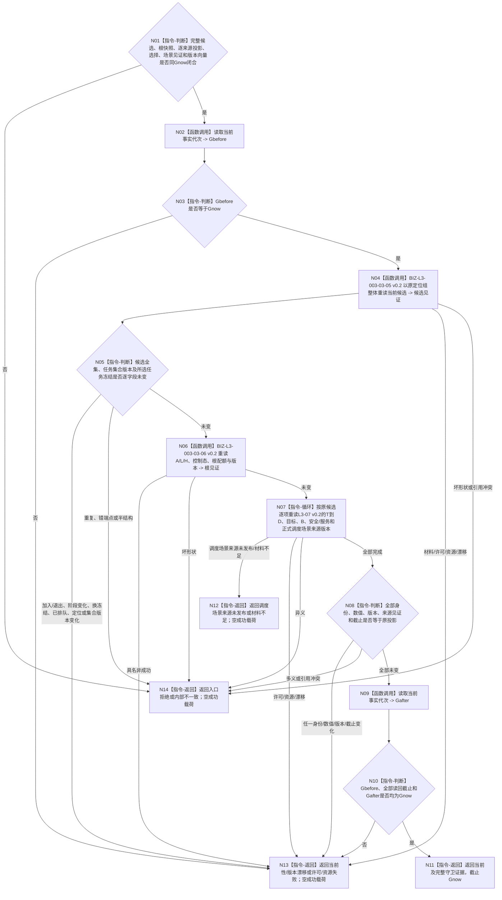

# BIZ-L3-003-03-10 复核普通派发选择当前性目标函数流程图 v0.3

更新时间：2026-08-27

## 依据

```text
0050、3200、4230、5200、5230、6150、6170、8100
父图：BIZ-L2-003-03 v0.4
复用：BIZ-L3-003-03-05 v0.2、06/07 v0.2
替代关系：v0.3以正式安全调度适用场景来源版本替代v0.2共同作用场景守卫
```

## 身份与边界

正式目标函数替代图。本函数在返回派发选择前，以原 `Gnow` 和原任务管理候选定位组整体重放 L3-05 v0.2，重新取得中性任务全集、逐任务BIZ候选及任务集合版本；随后重读 L3-06 根事实、L3-07 当前冻结/T→D/目标/B/安全与服务材料，并守卫任务级安全调度适用场景的正式来源身份、版本和截止。

只重读所选任务、只比较线程定位组或只看全局事实代次均不足。候选加入/退出、阶段变化、已排队、基础优先级变化、调度场景来源变化、T→D或任一安全/服务版本变化都使旧选择失效。本函数不发布排队事实、不构造工作包，也不替代动作开始前的再次fresh复核。

## 函数合同

```text
根函数：任务普通派发选择组合器::复核普通派发选择当前性
归属模块 / 文件 / 目标分解深度：任务普通派发选择 / 海中鱼巣/领域/内部治理/服务.任务普通派发选择.ixx / BIZ-L3
可见性：module-private；只由BIZ-L2-003-03 v0.4根组合器在返回前调用
现有或待新增：待新增；依赖L3-05 v0.2、06/07 v0.2及其具名缺口闭合
完整签名：普通派发选择当前性复核结果 任务普通派发选择组合器::复核普通派发选择当前性(const 普通派发选择当前性复核请求& 请求) const noexcept
参数：请求只读借用；含原L3-05候选读回与定位组、L3-06根快照、L3-07/08逐候选证据、L3-09选择结果、正式安全调度适用场景读回见证、Gnow及全部来源版本向量
返回结果：当前、调度场景来源未发布、当前性漂移、版本漂移、材料不足、入口拒绝、许可拒绝、资源失败或内部不一致；只有当前返回原完整结果身份、守卫证据和截止Gnow
被调函数流程图：BIZ-L3-003-03-05 v0.2、06/07 v0.2；各正式owner版本读取能力，不重新计算投影
```

## 流程图



## 节点合同

| 节点 | 类型 | 输入绑定 | 输出绑定 | 事实读写 | 验证 |
| --- | --- | --- | --- | --- | --- |
| N04/N05 | L3-05整体重放 / 互证 | 原候选、定位、集合版本、Gnow | 当前完整候选见证 | 只读task、存在、状态、冻结和排队事实 | 加入/退出、阶段、冻结、排队和集合版本变化 |
| N06 | L3-06重读 | 原根快照、Gnow | 当前A/L/H、控制态与根配额 | 只读生存安全根事实 | 根值、阈值、维护来源和规则版本变化 |
| N07/N08 | L3-07整体重读 / 判断 | 原逐来源证据、正式场景见证、版本向量 | 全部未变或具名失败 | 只读任务、需求、因果、安全和服务owner | T→D、目标、B、调度场景来源、安全/服务和排序版本 |
| N02/N09/N10 | 读取 / 守卫 | Gnow | 读前后共同截止 | 只读当前事实代次 | 读前、逐项、读后不一致 |

## 关键边界

- L3-05必须整体重放；只重读所选任务不足以证明候选全集与排序仍当前。
- 安全调度适用场景必须比较正式来源身份、场景身份、版本和Gnow；比较裸场景值不能证明来源未漂移。
- 场景producer尚未发布时返回具名非成功，不能以动作目标/self位置重新构造后继续。
- 守卫成功只覆盖选择返回前；工作包冻结与动作开始前仍各自再次fresh复核。

## v0.3 校正记录

- 增加L3-06 v0.2根快照整体重读和L3-07 v0.2逐来源整体重读。
- 删除“共同作用场景”守卫，改为任务级安全调度适用场景正式来源身份、版本与截止守卫。
- 将基础优先级、场景来源、T→D、安全/服务材料和根配额变化全部纳入派发前失效矩阵。
