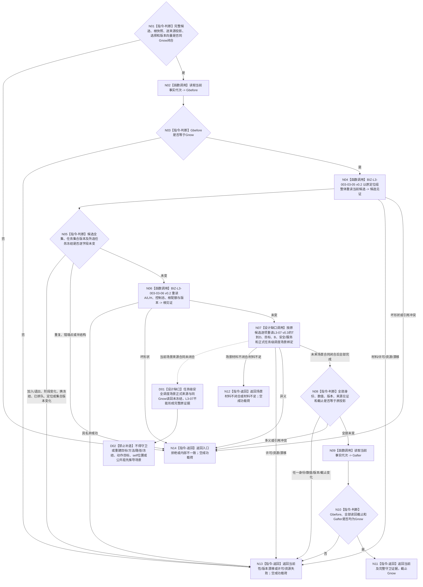

# BIZ-L3-003-03-10 复核普通派发选择当前性目标函数流程图 v0.4

更新时间：2026-08-28

## 依据

```text
0050 v2.1、3200、4230、5200、5230 v1.2、6150 v0.7、6170、8100 v0.7
父图：BIZ-L2-003-03 v0.5
复用：BIZ-L3-003-03-05 v0.2、06 v0.2；07 v0.3为场景来源设计缺口图
替代关系：v0.4撤回v0.3对未发布共同作用场景见证的守卫，恢复任务级安全调度场景来源DRIFT
```

## 身份与边界

正式目标函数设计缺口图。本函数在返回派发选择前，以原 `Gnow` 和原任务管理候选定位组整体重放 L3-05 v0.2，重新取得中性任务全集、逐任务BIZ候选及任务集合版本；随后重读 L3-06 根事实，并要求逐候选重读 L3-07 v0.3 的当前冻结、T→D、目标、B、安全与服务材料。

候选全集、阶段、排队、根事实、T→D、目标、B和服务版本的整体重放边界已经冻结；安全来源部分仍依赖尚未冻结的任务级安全调度适用场景正式绑定。本函数不得守卫一份上游从未正式生产的“共同作用场景互证见证”。在L3-07场景来源DRIFT闭合前，本函数不能返回当前，也不能从局部对象重建场景后继续。

## 函数合同

```text
根函数：任务普通派发选择组合器::复核普通派发选择当前性
归属模块 / 文件 / 目标分解深度：任务普通派发选择 / 海中鱼巣/领域/内部治理/服务.任务普通派发选择.ixx / BIZ-L3
可见性：module-private；只由BIZ-L2-003-03 v0.5根组合器在返回前调用
现有或待新增：部分目标已冻结但整体不可施工；依赖L3-05 v0.2、06 v0.2和07 v0.3两个具名缺口闭合
完整签名：目标函数身份保留；任务级场景来源字段未冻结前不得生成完整C++ ABI
参数：已确定含原L3-05候选读回与定位组、L3-06根快照、L3-07/08逐候选证据、L3-09选择结果、Gnow及全部来源版本向量；未来只接受L3-07正式读回的任务级安全调度场景绑定与见证，不接收调用方自造共同作用场景
返回结果：至少区分当前、场景材料不闭合、当前性/版本漂移、材料不足、入口/许可拒绝、资源失败或内部不一致；只有场景来源合同闭合且全部整体重放相等才可返回当前
被调函数流程图：BIZ-L3-003-03-05 v0.2、06 v0.2、07 v0.3；各正式owner版本读取能力，不重新计算投影
```

## 流程图



## 节点合同

| 节点 | 类型 | 输入绑定 | 输出绑定 | 事实读写 | 验证 |
| --- | --- | --- | --- | --- | --- |
| N04/N05 | L3-05整体重放 / 互证 | 原候选、定位、集合版本、Gnow | 当前完整候选见证 | 只读task、存在、状态、冻结和排队事实 | 加入/退出、阶段、冻结、排队和集合版本变化 |
| N06 | L3-06重读 | 原根快照、Gnow | 当前A/L/H、控制态与根配额 | 只读生存安全根事实 | 根值、阈值、维护来源和规则版本变化 |
| N07/N08/D01/D02 | L3-07整体重读 / 判断 / 设计缺口 | 原逐来源证据、未来正式任务级调度场景绑定、版本向量 | 全部未变、具名失败或场景来源DRIFT | 当前场景分支零调用；其它目标为只读正式owner | T→D、目标、B、安全/服务及未来正式场景绑定逐字段互证；不得守卫伪见证 |
| N02/N09/N10 | 读取 / 守卫 | Gnow | 读前后共同截止 | 只读当前事实代次 | 读前、逐项、读后不一致 |

## 关键边界

- L3-05必须整体重放；只重读所选任务不足以证明候选全集与排序仍当前。
- 世界中多个存在同属较高层场景不等于任务级安全调度场景已经被正式选择；只有未来正式producer及同Gnow读回见证才能进入守卫。
- 任一来源材料或场景正式读回不闭合时返回具名非成功，不能以动作目标/self位置重新构造后继续。
- 守卫成功只覆盖选择返回前；工作包冻结与动作开始前仍各自再次fresh复核。

## v0.4 校正记录

- 保留L3-05候选全集、L3-06根快照和L3-07逐来源材料的整体重读方向。
- 撤回v0.3守卫未发布共同作用场景见证的口径；场景producer、字段、绑定和读回闭合前零当前成功。
- 基础优先级、T→D、安全/服务材料和根配额仍须整体守卫，独立缺口不因场景DRIFT回退。
