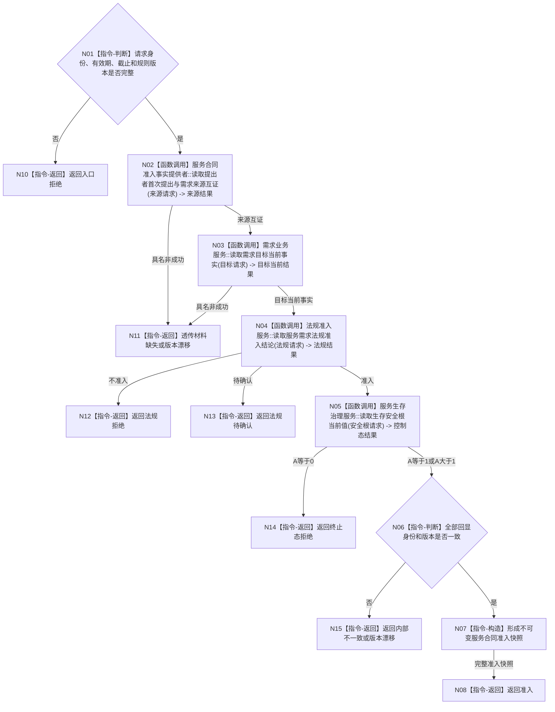

# BIZ-L3-003-04-01 复核服务需求与法规准入目标函数流程图 v0.1

更新时间：2026-08-03

## 依据

```text
0050、6160、6170
父图：BIZ-L2-003-04
```

## 身份与边界

正式目标函数设计图。只读复核真实提出、需求目标范围、法规结论和生存控制态；准入不等于合同已建立或任务可执行。

## 函数合同

```text
根函数：复核服务需求与法规准入
归属模块 / 文件 / 层级：服务合同治理 / 海中鱼巣/领域/服务.服务合同.ixx / L3
现有或待新增：待新增；复用需求、提出者、法规和生存安全根只读服务
完整签名：服务合同准入结果 服务合同服务::复核服务需求与法规准入(const 服务合同准入请求& 请求) const
参数：请求为只读借用；绑定自我、提出者、需求、首次提出事件、目标合同、服务范围、有效期、运行代次、事实截止见证向量、法规/合同/目标/安全根规则版本；法规结论与安全根控制态必须由本函数重新读取
返回结果：服务合同准入结果；包含准入、法规拒绝、待确认、终止态拒绝、材料缺失、版本漂移或内部不一致，以及完整准入快照
被调函数流程图：BIZ-L4-003-04-01-01 `服务合同准入事实提供者::读取提出者首次提出与需求来源互证`；复用BIZ-L3-004-01-01 `需求业务服务::读取需求目标当前事实`；BIZ-L4-003-04-01-02 `法规准入服务::读取服务需求法规准入结论`；复用BIZ-L4-002-05-01-01 `服务生存治理服务::读取生存安全根当前值`
```

## 流程图



## 节点合同

| 节点 | 类型 | 输入绑定 | 输出绑定 | 事实读写 | 后继条件 | 验证 |
| --- | --- | --- | --- | --- | --- | --- |
| N02/N03 | 函数调用 | 提出者、需求、事件、目标、范围 | 来源与需求事实 | 只读 | 必须当前 | 伪造/旧版本 |
| N04 | 函数调用 | 需求范围和法规版本 | 准入结论 | 只读 | 待确认不视为准入 | 法规分支 |
| N05 | 函数调用 | 自我和截止版本 | A控制态 | 只读 | A=0拒绝 | 0/1/>1 |

## 关键边界

- 自我不得代替提出者复制历史需求或自动续期。
- A=1允许合同准入，但不授予普通服务任务执行权限。
- 准入结果不是服务值增加来源，只有合同建立事务才能结算预支。
