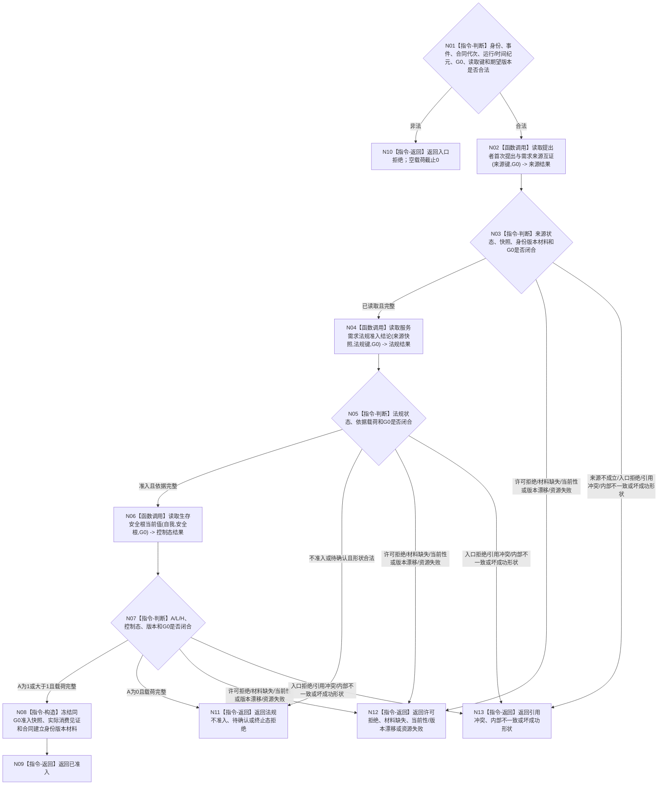

# BIZ-L3-003-04-01 复核服务需求与法规准入目标函数流程图 v0.2

更新时间：2026-08-27

## 依据

```text
0050、4050、6120、6160、6170
父图：BIZ-L2-003-04 v0.2
```

## 身份与边界

正式目标函数设计图。只在同一来源截止G0读取真实提出、需求目标/范围/有效期、法规三态、生存控制根和合同建立身份版本材料，形成不可变准入快照；不建立合同、不增加服务值、不产生普通派发或现实执行授权。

## 函数合同

```text
根函数：服务合同服务::复核服务需求与法规准入
归属模块 / 文件 / 目标分解深度：服务合同治理 / 海中鱼巣/领域/服务.服务合同.ixx / BIZ-L3
现有或待新增：待新增组合读取；复用需求/关系中性读取及生存安全根正式读取，法规和服务合同准入provider待实现
完整签名：服务合同准入结果 服务合同服务::复核服务需求与法规准入(const 服务合同准入请求& 请求) const noexcept
参数：请求为只读借用；绑定自我、提出者、需求、首次提出事件、合同代次、运行/时间纪元、来源事实截止G0、法规规则读取键、合同建立身份版本材料读取键和全部期望版本；不携带调用方裁决的目标、范围、有效期、法规结论或控制态
返回结果：已准入时携带同G0来源/目标/范围/有效期、法规依据、A/L/H控制态、合同建立身份版本材料和完整读取见证；法规不准入、待确认、终止态拒绝及全部具名非成功零成功载荷
被调函数流程图：BIZ-L4-003-04-01-01—02 v0.2；复用BIZ-L4-002-05-01-01 v0.2生存安全根读取
```

## 流程图



## 节点合同

| 节点 | 类型 | 输入绑定 | 输出绑定 | 事实读写 | 后继条件 | 验证 |
| --- | --- | --- | --- | --- | --- | --- |
| N01—N03 | 判断 / 调用 | 来源读取键和G0 | 需求来源完整快照 | 只读提出者、需求与关系事实 | 0/1/N与身份版本材料均闭合 | 自动续期、旧需求、跨纪元缺证据 |
| N04—N05 | 调用 / 判断 | 来源快照、法规键和G0 | 三态法规结论与依据 | 只读法规规则/事实 | 待确认不得当准入 | 规则换代、范围漂移、依据不足 |
| N06—N07 | 调用 / 判断 | 自我、安全根和G0 | A/L/H及控制态 | 只读正式安全根 | A=0拒绝；A=1不等于派发授权 | 0/1/大于1、版本与截止 |
| N08—N13 | 构造 / 返回 | 三组同G0读回 | 准入快照或具名非成功 | 无 | 返回父图 | 状态×载荷、所有非成功空载荷 |

## 关键边界

- 自我、任务、方法或历史合同不能代替提出者产生新提出事件；缺少连续时间证明时不得猜测有效期。
- 准入快照只证明合同可以继续建立。它不证明需求已满足、任务可派发、方法可执行或现实动作已授权。
- 合同建立身份、版本和发布代次材料只来自正式provider；本函数、预算算法和线程不得生成或递增。
