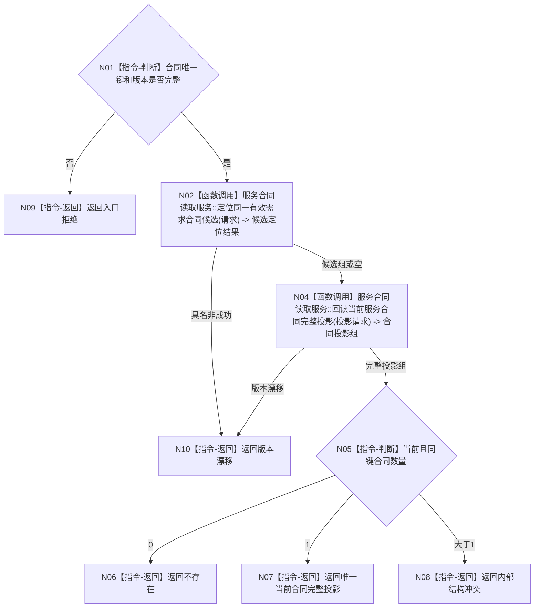

# BIZ-L3-003-04-02 读取同一有效需求当前服务合同目标函数流程图 v0.1

更新时间：2026-08-03

## 依据

```text
0050、6160
父图：BIZ-L2-003-04
```

## 身份与边界

正式目标函数设计图。按合同唯一键读取当前完整投影，索引只负责定位候选，不承担合同事实裁决。

## 函数合同

```text
根函数：读取同一有效需求当前服务合同
归属模块 / 文件 / 层级：服务合同读取 / 海中鱼巣/领域/服务.服务合同读取.ixx / L3
现有或待新增：待新增
完整签名：当前服务合同读取结果 服务合同读取服务::读取同一有效需求当前服务合同(const 当前服务合同读取请求& 请求) const
参数：请求为只读借用；包含自我、提出者、需求、首次提出事件、合同代次、事实截止版本和合同规则版本
返回结果：当前服务合同读取结果；包含不存在、唯一当前合同、版本漂移、结构冲突或内部错误，以及调用方拥有的完整值式合同投影
被调函数流程图：BIZ-L4-003-04-02-01 `服务合同读取服务::定位同一有效需求合同候选`；BIZ-L4-003-04-02-02 `服务合同读取服务::回读当前服务合同完整投影`
```

## 流程图



## 节点合同

| 节点 | 类型 | 输入绑定 | 输出绑定 | 事实读写 | 后继条件 | 验证 |
| --- | --- | --- | --- | --- | --- | --- |
| N02 | 函数调用 | 合同唯一键 | 候选组 | 只读 | 索引可回源 | 缓存不可用 |
| N04 | 函数调用 | 候选身份 | 完整合同投影 | 只读同一代次 | 不使用半投影 | 关系/记录互证 |
| N05 | 指令-判断 | 当前合同投影组 | 唯一性结果 | 无 | 大于1为内部错误 | 双合同 |

## 关键边界

- “不存在”是合法结果；索引未命中不能单独证明不存在。
- 同键同义由调用方按完整投影裁决精确重复，同键异义不得覆盖。
- 本函数不建立合同、不推进状态、不支付预支。
