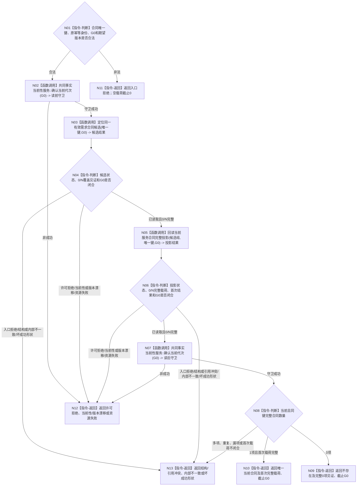

# BIZ-L3-003-04-02 读取同一有效需求当前服务合同目标函数流程图 v0.2

更新时间：2026-08-27

## 依据

```text
0050、4010、4050、6160
父图：BIZ-L2-003-04 v0.2
```

## 身份与边界

正式目标函数设计图。按合同唯一键和同一G0读取完整0/N候选覆盖、逐候选完整投影及首次发布结果，严格裁决0/1/多项当前合同；索引只作提示，不证明完整、唯一或不存在。

## 函数合同

```text
根函数：服务合同读取服务::读取同一有效需求当前服务合同
归属模块 / 文件 / 目标分解深度：服务合同读取 / 海中鱼巣/领域/服务.服务合同读取.ixx / BIZ-L3
现有或待新增：待新增；HEAD无服务合同记录、关系、结算及幂等联合读回
完整签名：当前服务合同读取结果 服务合同读取服务::读取同一有效需求当前服务合同(const 当前服务合同读取请求& 请求) const noexcept
参数：请求为只读借用；含自我、提出者、需求、首次提出事件、合同代次、原幂等身份、G0及合同/状态/结算/服务值/幂等期望版本
返回结果：不存在为完整0项逻辑成功；唯一当前合同返回完整合同、P0阶段、服务值变化、原幂等账、首次G1及首次完整载荷；多项、半结构或同键异义为结构/引用冲突。所有成功截止等于G0，所有非成功空载荷截止0
被调函数流程图：BIZ-L4-003-04-02-01—02 v0.2
```

## 流程图



## 节点合同

| 节点 | 类型 | 输入绑定 | 输出绑定 | 事实读写 | 后继条件 | 验证 |
| --- | --- | --- | --- | --- | --- | --- |
| N01—N04 | 判断 / 调用 | 合同键、原幂等身份和G0 | 0/N完整候选覆盖 | 只读索引提示与正式关系 | 关系覆盖证明完整性 | 索引空/漏/多/陈旧、关系0/N |
| N05—N06 | 调用 / 判断 | 候选组与固定G0 | 完整当前投影及首次载荷 | 只读记录、状态、结算、服务值、幂等 | 半投影不得进入计数 | 历史隔离、错版本、同键异义 |
| N02/N07 | 调用 | G0 | 读前/读后守卫 | 只读共同当前代次 | 两次均成功 | 前后漂移 |
| N08—N13 | 判断 / 返回 | 完整组与守卫 | 0/1结果或具名非成功 | 无 | 多项停止依赖路径 | 0/1/大于1、状态×载荷 |

## 关键边界

- “不存在”必须由正式关系全集、全部候选完整回读和G0双守卫共同证明；索引未命中、SQL空行或缓存空不能单独证明。
- 精确重复所需首次完整结果必须来自原幂等账和首次G1历史读回，不从当前合同净值、候选比较或调用方旧载荷重建。
- 本函数只读，不建立合同、不推进状态、不支付P0，也不把终态历史合同恢复为当前。
