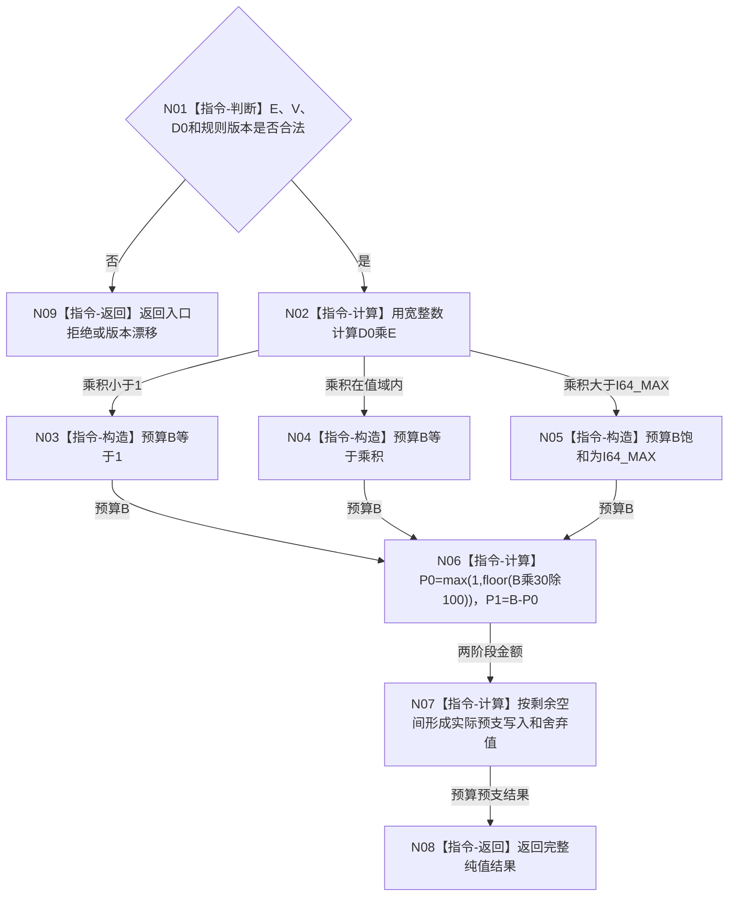

# BIZ-L3-003-04-03 计算服务合同预算与预支目标函数流程图 v0.1

更新时间：2026-08-03

## 依据

```text
6160、6170
父图：BIZ-L2-003-04
```

## 身份与边界

正式目标函数设计图。纯值算法冻结合同总预算、30%预支、70%余款及服务值饱和增加结果。

## 函数合同

```text
根函数：计算服务合同预算与预支
归属模块 / 文件 / 层级：服务合同预算算法 / 海中鱼巣/领域/算法.服务合同预算.ixx / L3
现有或待新增：待新增
完整签名：服务合同预算预支结果 计算服务合同预算与预支(const 服务合同预算预支请求& 请求) noexcept
参数：请求为只读借用；包含冻结有效秒E、当前服务值V、D0、I64_MAX和预算规则版本，E必须大于0且V在值域内
返回结果：服务合同预算预支结果；包含B、P0、P1、实际写入、舍弃值和结算后V，或入口拒绝、版本漂移、算术错误
被调函数流程图：无
```

## 流程图



## 节点合同

| 节点 | 类型 | 输入绑定 | 输出绑定 | 事实读写 | 后继条件 | 验证 |
| --- | --- | --- | --- | --- | --- | --- |
| N02-N05 | 计算/构造 | D0、E、M | B | 无 | 预算允许饱和 | 默认与长有效期 |
| N06 | 指令-计算 | B | P0/P1 | 无 | P0+P1=B | 30/70与小值 |
| N07 | 指令-计算 | V、P0、M | 实际写入/舍弃/Vnew | 无 | 先比较剩余空间 | I64_MAX边界 |

## 关键边界

- 预算在合同建立时冻结，等待、任务拆分和方法重试不得扩大B。
- 除法余数直接舍弃，不累计、不补偿。
- 饱和舍弃值以后不得补领，但预支阶段仍必须标记已结算。

