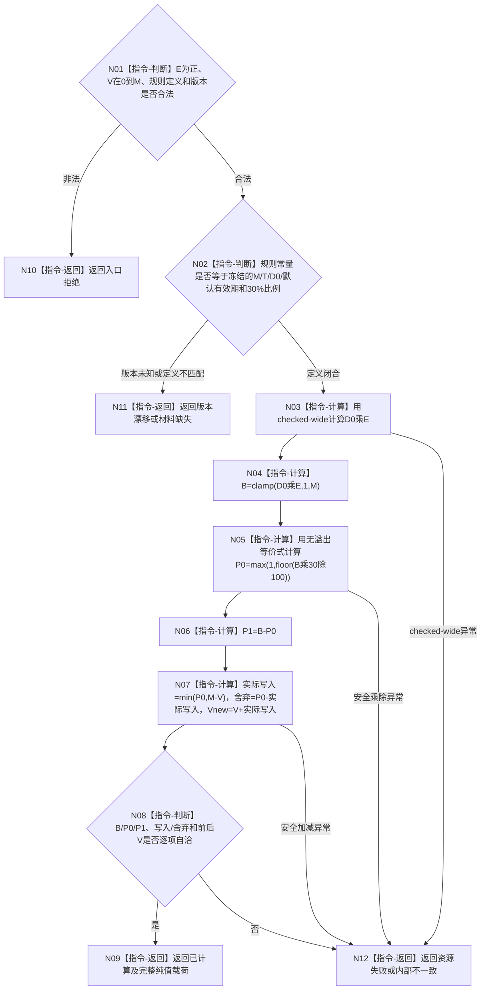

# BIZ-L3-003-04-03 计算服务合同预算与预支目标函数流程图 v0.2

更新时间：2026-08-27

## 依据

```text
0050、4050、6160
父图：BIZ-L2-003-04 v0.2
```

## 身份与边界

正式目标函数设计图。纯值算法按正式规则版本冻结合同总预算、30%预支、70%余款及服务值饱和增加结果；不读仓库、不取当前时间、不生成身份/版本、不发布事实，也不拥有权威精确重复语义。

## 函数合同

```text
根函数：计算服务合同预算与预支
归属模块 / 文件 / 目标分解深度：服务合同预算算法 / 海中鱼巣/领域/算法.服务合同预算.ixx / BIZ-L3
现有或待新增：待新增纯值函数
完整签名：服务合同预算预支结果 计算服务合同预算与预支(const 服务合同预算预支请求& 请求) noexcept
参数：请求为只读借用；只含已正式冻结的有效秒E、当前服务值V和预算规则定义/版本。M、T、D0、默认有效期和比例来自该正式规则，不允许调用方另传可变常量
返回结果：已计算时携带B、P0、P1、实际写入、饱和舍弃和Vnew；入口拒绝、版本漂移、材料缺失、资源失败或内部不一致无成功载荷
被调函数流程图：无
```

## 流程图



## 节点合同

| 节点 | 类型 | 输入绑定 | 输出绑定 | 事实读写 | 后继条件 | 验证 |
| --- | --- | --- | --- | --- | --- | --- |
| N01—N02 | 判断 | E、V与正式规则 | 合法固定算法域 | 无 | 调用方不能改D0/M | 默认/显式E、未知版本、错规则 |
| N03—N04 | 计算 | D0、E、M | B | 无 | checked-wide后饱和 | 1、默认预算、超长E、M边界 |
| N05—N06 | 计算 | B和30%规则 | P0/P1 | 无 | P0+P1=B | 小B、余数舍弃、无溢出等价 |
| N07—N09 | 计算 / 判断 / 返回 | V、P0、M | 写入/舍弃/Vnew | 无 | 饱和仍完成P0阶段候选 | V=0/M、零实际写入、舍弃不补领 |
| N10—N12 | 返回 | 非成功 | 空成功载荷 | 无 | 返回父图 | 状态×载荷 |

## 关键边界

- 规则版本1的M、T、D0和默认有效期由6160固定；等待、服务数量、任务/方法/线程/消息数量均不参与预算。
- 除法余数和饱和超额永久舍弃，不累计、不补偿；P0阶段仍必须由后继事务标记已结算。
- 相同输入得到相同候选只是纯值确定性，不是权威精确重复；原合同与P0是否已发布只能由正式账和首次读回裁决。
