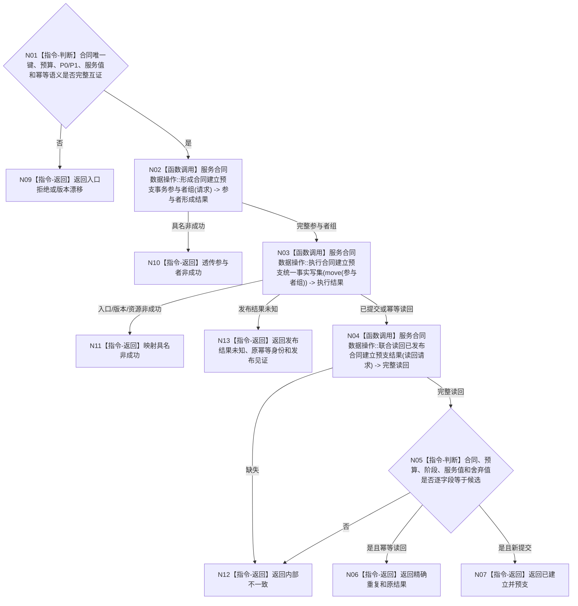

# BIZ-L3-003-04-04 发布合同建立预支事务目标函数流程图 v0.1

更新时间：2026-08-03

## 依据

```text
0050、6160
父图：BIZ-L2-003-04
```

## 身份与边界

正式目标函数设计图。合同、有效期、冻结预算、30%预支、服务值状态动态和幂等账在一个独立事务中原子发布。

## 函数合同

```text
根函数：发布合同建立预支事务
归属模块 / 文件 / 层级：服务合同数据操作 / 海中鱼巣/领域/数据操作.服务合同.ixx / L3
现有或待新增：待新增
完整签名：服务合同建立结果 服务合同数据操作::发布合同建立预支事务(合同建立预支事务请求&& 请求) noexcept
参数：请求为右值并转移候选所有权；包含合同稳定身份、需求归属、有效期、预算、P0/P1、服务值前后状态、动态、关系、结算阶段、幂等账、候选代次和来源版本
返回结果：服务合同建立结果；包含已建立并预支、精确重复、入口拒绝、版本漂移、资源失败或内部不一致，以及合同与预支权威读回
被调函数流程图：BIZ-L4-003-04-04-01 `服务合同数据操作::形成合同建立预支事务参与者组`；BIZ-L4-003-04-04-02 `服务合同数据操作::执行合同建立预支统一事实写集`；BIZ-L4-003-04-04-03 `服务合同数据操作::联合读回已发布合同建立预支结果`
```

## 流程图



## 节点合同

| 节点 | 类型 | 输入绑定 | 输出绑定 | 事实读写 | 后继条件 | 验证 |
| --- | --- | --- | --- | --- | --- | --- |
| N02 | 函数调用 | move-only事务请求 | 全参与者组 | 仅候选 | 非空互异 | 所有权与版本 |
| N03 | 函数调用 | 核心候选与参与者 | 执行结果 | 原子发布 | 全确认或撤销 | 故障注入 |
| N04/N05 | 调用/判断 | 幂等键与候选 | 完整读回 | 只读已发布代次 | 全字段一致 | 精确重复 |

## 关键边界

- 本事务不修改生存安全根；唤醒只能在后续完整秒维护形成。
- 同一有效需求不得出现第二当前合同或第二次P0。
- 发布后读回不一致属于内部不一致，不得以SQL或日志补写修复。
