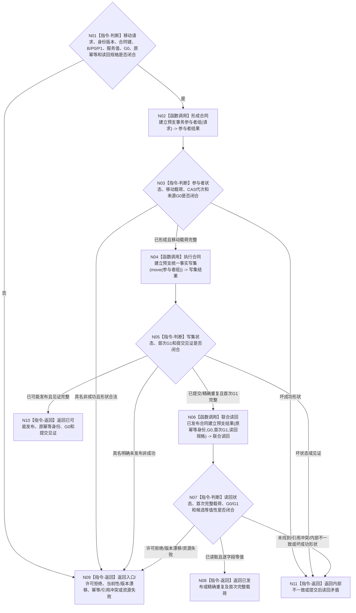

# BIZ-L3-003-04-04 发布合同建立预支事务目标函数流程图 v0.2

更新时间：2026-08-27

## 依据

```text
0050、4040、4050、6160
父图：BIZ-L2-003-04 v0.2
```

## 身份与边界

正式目标函数设计图。把合同、有效期、冻结预算、P0/P1阶段、服务值状态动态、正式关系和幂等账作为一个不透明事务完成准备、确认、最后发布及首次联合读回；不修改生存安全根。

## 函数合同

```text
根函数：服务合同数据操作::发布合同建立预支事务
归属模块 / 文件 / 目标分解深度：服务合同数据操作 / 海中鱼巣/领域/数据操作.服务合同.ixx / BIZ-L3
现有或待新增：待新增；复用4040不透明事务底座，合同/服务值/关系/幂等参与者和历史读回待实现
完整签名：服务合同建立结果 服务合同数据操作::发布合同建立预支事务(合同建立预支事务请求&& 请求) noexcept
参数：请求为右值并转移候选所有权；携带正式合同建立身份版本材料、合同唯一键、B/P0/P1、服务值前后状态动态、关系、结算阶段、各owner紧邻写入CAS代次、来源G0、原幂等身份和首次读回规格
返回结果：已发布/精确重复成功时携带首次完整载荷、G0和首次G1；入口/许可拒绝、当前性/版本漂移、幂等/引用冲突、资源失败、已可能发布或内部不一致结构化分账
被调函数流程图：BIZ-L4-003-04-04-01—03 v0.2
```

## 流程图



## 节点合同

| 节点 | 类型 | 输入绑定 | 输出绑定 | 事实读写 | 后继条件 | 验证 |
| --- | --- | --- | --- | --- | --- | --- |
| N01—N03 | 判断 / 调用 | 完整候选、G0和各owner CAS | 唯一移动参与包 | 只构造候选 | 身份版本材料原样消费 | 漏参与者、错代、重复、分配失败 |
| N04—N05 | 调用 / 判断 | 核心写集和参与者 | 提交/重复/未知/明确未发布 | 一个不透明事务 | 全确认、逆序撤销、最后交换 | 第一写前冲突、确认失败、交换未知 |
| N06—N07 | 调用 / 判断 | 原键、G0、首次G1和规格 | 首次联合载荷 | 只读历史已发布事实 | 不拼当前最新 | 漏/多/异义、错G0/G1、P0只一次 |
| N08—N11 | 返回 | 已复核结果 | 结构化父级结果 | 无新增写入 | 返回根图 | 状态×载荷与提交见证 |

## 关键边界

- 来源事实截止G0与各owner紧邻写入CAS代次、首次发布/读回G1分账；不得把G0当写入代次，也不得把首次G1当当前事实截止。
- 精确重复零新应用并返回首次G1和首次完整载荷。交换结果未知只按原幂等身份与提交见证收敛，禁止换键重试。
- 合同、P0阶段、服务值状态动态、关系和幂等账必须同事务成立；发布前失败零普通可读半结构，发布后不得用SQL回滚。
