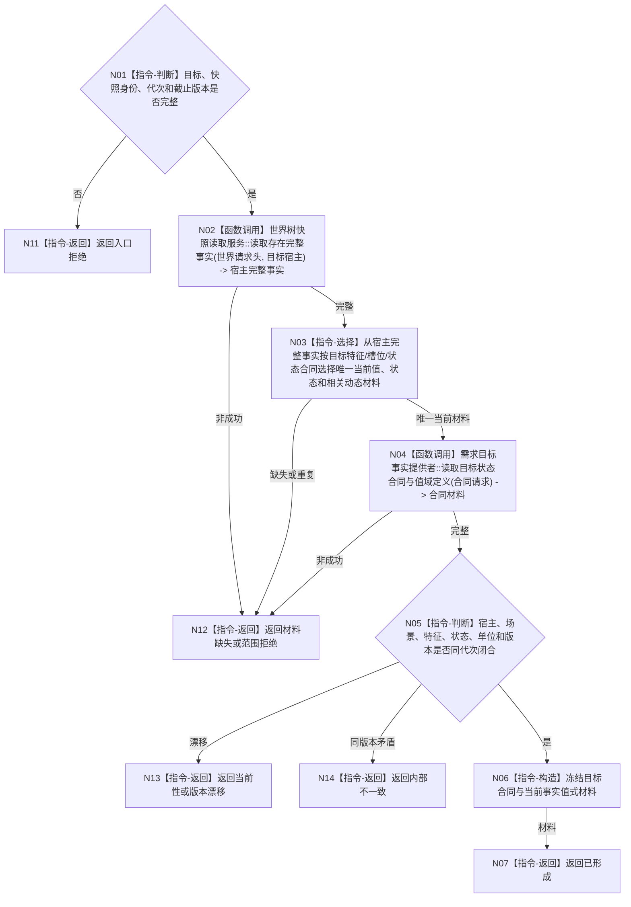

# BIZ-L3-004-01-01 读取需求目标当前事实目标函数流程图 v0.1

更新时间：2026-08-03

## 依据

```text
3100、5100、4160、4190、4200；BIZ-L2-004-01
```

## 身份与边界

正式目标函数设计图。按目标合同和固定事实截止版本读取目标宿主的当前场景、特征、状态和值域材料；不比较差距，不要求需求已存在。

## 函数合同

```text
根函数：需求业务服务::读取需求目标当前事实
归属模块 / 文件 / 层级：需求目标只读组合 / 海中鱼巣/领域/服务.需求.ixx / L3
现有或待新增：适配扩展；复用世界、状态和特征正式读取服务，不直达底层仓库
完整签名：需求目标当前事实结果 需求业务服务::读取需求目标当前事实(const 需求目标当前事实请求& 请求) const
参数：请求为只读借用；含自我、目标宿主、场景、目标特征、目标状态合同、世界快照身份、运行代次、事实截止版本和值域规则版本
返回结果：不可变值式结果；含已形成、材料缺失、宿主不在范围、当前性漂移、版本漂移或内部不一致，以及目标合同和同截止当前事实材料
被调函数流程图：复用4200 `世界树快照读取服务::读取存在完整事实`（由WORLD-TREE设计包冻结，不在本目录复制同函数图）；BIZ-L4-004-01-01-01 `需求目标事实提供者::读取目标状态合同与值域定义`
父图：BIZ-L2-004-01；BIZ-L2-004-05可复用；BIZ-L3-002-06-04复用本入口重判父需求当前目标事实
```

## 流程图



## 节点合同

| 节点 | 类型 | 输入 | 输出 | 事实读写 | 验证 |
| --- | --- | --- | --- | --- | --- |
| N02 | 函数调用 | 世界请求头、目标宿主和固定截止 | 宿主、场景、全部当前特征/状态/动态 | 只读4200快照服务 | 同代次完整快照 |
| N03 | 指令-选择 | 宿主完整事实与目标合同 | 唯一当前目标材料 | 无 | 缺失/重复拒绝 | 稳定身份选择，不按名称或容器顺序 |
| N04 | 函数调用 | 目标状态、特征定义和值域规则版本 | 目标合同和值域定义 | 只读定义服务 | 版本兼容 | 单位、维度、比较资格 |
| N05/N06 | 判断 / 构造 | 三组材料 | 当前事实包 | 无 | 单位、值域、场景和版本闭合 |
| N07/N11—N14 | 返回 | 读取状态 | 结构化结果 | 无写入 | 缺失、范围、漂移分离 |

## 关键边界

SQL、缓存、日志、UI和工作线程私有输出不得补齐当前事实。目标候选尚未形成需求时仍允许读取，但目标合同本身必须完整且可回查。
