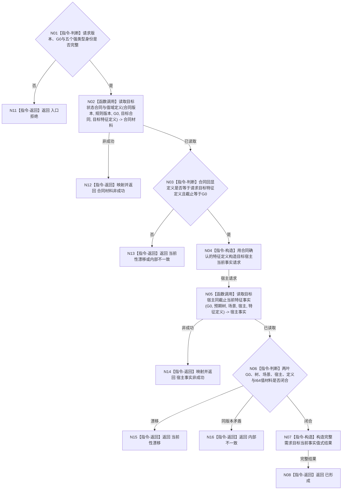

# BIZ-L3-004-01-01 读取需求目标当前事实目标函数流程图 v0.2

更新时间：2026-08-16

## 依据

```text
3100、4110、4160、4180、4190、4200 v1.4、4230 v0.10、5100 v0.2；BIZ-L2-004-01
BIZ-L4-004-01-01-01 v0.2；BIZ-L4-004-01-01-02 v0.1
```

## 身份与边界

正式目标函数设计图。按一个非零事实截止 `G0` 先读取目标状态合同、完整特征定义与目标判断比较注册，再读取指定具名场景树和场景内目标宿主的唯一同定义当前特征实例和值。它不比较差距，不读取或补造状态 / 动态，不创建需求，也不复活旧 4200 世界树业务门面。

v0.2 正式替代 v0.1。旧请求中的“世界快照身份”、旧 `世界树快照读取服务::读取存在完整事实`、从宿主快照选择状态 / 动态以及跨服务拼装旧版本字段全部退出。

## 函数合同

```text
根函数：需求业务服务::读取需求目标当前事实
归属模块 / 文件 / 层级：需求目标只读组合 / 海中鱼巣/领域/服务.需求.ixx / BIZ-L3
现有或待新增：待新增；组合两个同 provider 子叶，不直达 DATA-L1
完整签名：需求目标当前事实结果 需求业务服务::读取需求目标当前事实(const 需求目标当前事实请求& 请求) const noexcept
参数：请求为只读借用；含 BIZ 合同版本、规则版本、非零 G0、预期场景树、目标场景、目标宿主、目标状态合同身份和目标特征定义身份
返回结果：不可变值式结果；成功携带目标合同材料、目标宿主当前特征事实及同一 G0；非成功零部分业务材料
被调函数流程图：BIZ-L4-004-01-01-01 v0.2；BIZ-L4-004-01-01-02 v0.1
父图：BIZ-L2-004-01；BIZ-L2-004-05 与 BIZ-L3-002-06-04 后继可复用
```

## 流程图



## 节点合同

| 节点 | 类型 | 参数 / 输入绑定 | 结果 / 输出绑定 | 事实读写 | 后继条件 | 验证 |
| --- | --- | --- | --- | --- | --- | --- |
| N02 | 函数调用 | 请求目标合同、目标定义、版本、G0 | 合同材料 | 只读 L4-01 | 具名状态 | 合同、定义、注册和 G0 完整 |
| N03/N04 | 本函数内指令 | 请求与合同回显 | 宿主请求 | 无 | 精确一致 | 不接受调用方另给定义 |
| N05 | 函数调用 | 同一 G0、树、场景、宿主、合同确认定义 | 宿主当前特征事实 | 只读 L4-02 | 具名状态 | 不读取状态 / 动态 |
| N06/N07 | 本函数内指令 | 两叶完整材料 | 值式当前事实结果 | 无 | 同 G0 且身份闭合 | I64 表示、单位 / 维度由合同叶承载 |
| N08/N11—N16 | 本函数内指令 | 具名状态 | 完整成功或零部分材料非成功 | 无 | 返回 | 不把日志 / 缓存补作事实 |

## 关键边界

```text
目标合同叶负责“要比较什么及怎样比较”；宿主事实叶负责“指定宿主现在有什么值”。
当前状态节点与动态节点不是当前特征值成立的前置，且不得从当前值自动生成。
差距裁决由 BIZ-L3-004-01-02 执行；本函数不直接调用比较算法。
目标候选尚未形成需求时仍可读取；需求身份不进入两个子叶请求。
```
