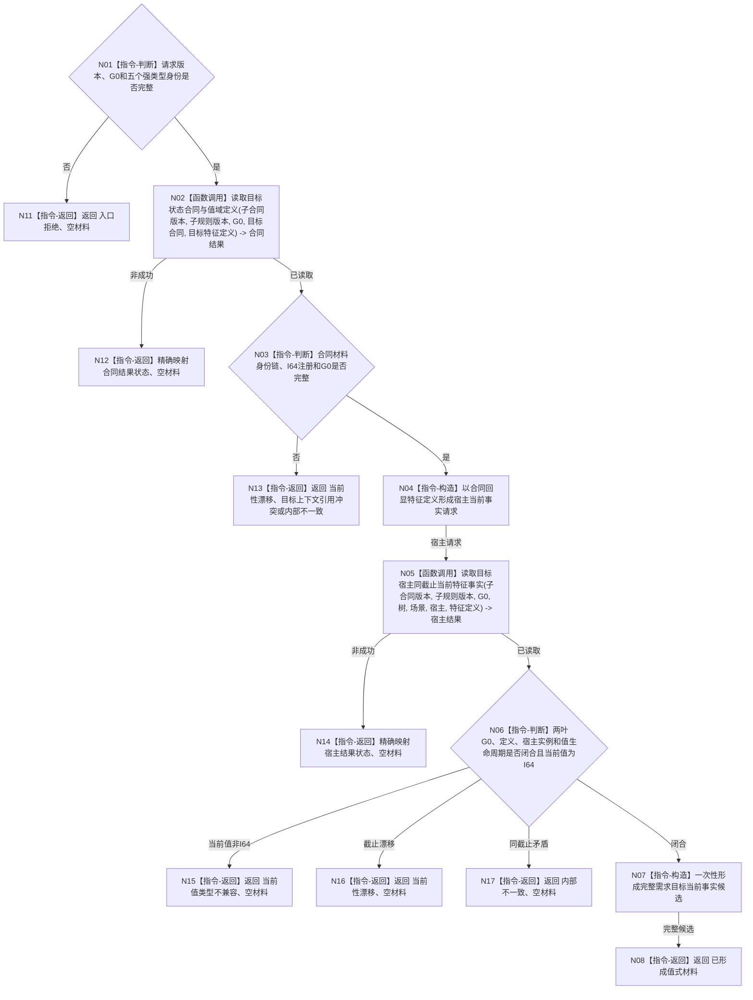

# BIZ-L3-004-01-01 读取需求目标当前事实目标函数流程图 v0.3

更新时间：2026-08-16

## 依据

```text
0050、3100、4110、4160、4180、4190、4200 v1.4、4230 v0.10、5100 v0.2
BIZ-L2-004-01、BIZ-L2-004-05
BIZ-L4-004-01-01-01 v0.2、BIZ-L4-004-01-01-02 v0.1
```

## 身份与边界

正式目标函数设计图。根函数只组合两个已经冻结的 BIZ L4 provider：先在调用方给定的非零事实截止 `G0` 读取目标状态合同、完整特征定义和目标判断比较注册，再以同一 `G0` 读取指定树 / 场景内目标宿主的唯一同定义当前特征实例和值。成功后发布一份不可变值式材料；不执行目标差距比较，不读取或补造状态 / 动态，不创建需求。

v0.3 正式替代 v0.2，并补齐父组合函数的精确 DTO、物理归属、两叶状态映射和 I64 当前值门禁。v0.1 的旧世界快照、旧 4200 业务门面及状态 / 动态拼装继续退出。

## 函数合同

```text
根函数：需求目标事实提供者::读取需求目标当前事实
归属模块 / 文件 / 层级：海中鱼巣.领域.提供者.需求目标事实 / 海中鱼巣/领域/提供者.需求目标事实.ixx / BIZ-L3
现有或待新增：待新增成员；继续扩展两个 L4 子函数所在的同一 provider，不新建第二 provider 或需求结构 owner
完整签名：需求目标当前事实结果 需求目标事实提供者::读取需求目标当前事实(const 需求目标当前事实请求& 请求) const noexcept
参数：请求为只读借用；含本函数合同版本、规则版本、非零 G0、预期场景树、目标场景、目标宿主、目标状态合同和目标特征定义五个强类型身份
返回结果：成功携带完整目标状态合同定义材料、完整目标宿主当前特征事实材料及同一 G0；所有非成功零部分业务材料
被调函数流程图：BIZ-L4-004-01-01-01 v0.2、BIZ-L4-004-01-01-02 v0.1
父图：BIZ-L2-004-01；BIZ-L2-004-05、BIZ-L3-002-06-04 后继复用
```

## 流程图



## 节点合同

| 节点 | 类型 | 参数 / 输入绑定 | 结果 / 输出绑定 | 事实读写 | 验证 |
| --- | --- | --- | --- | --- | --- |
| N02 | 函数调用 | 当前子合同版本、子规则版本、请求 G0 / 合同 / 定义 | `目标状态合同定义读取结果` | 只读 L4-01 | 恰一次调用；目标缺失、退出、漂移、许可和资源分账 |
| N03/N04 | 本函数内指令 | 请求与完整合同材料 | `目标宿主当前特征事实读取请求` | 无 | 宿主请求的定义只能来自合同回显，不接受第二选择 |
| N05 | 函数调用 | 同一 G0、请求树 / 场景 / 宿主、合同回显定义 | `目标宿主当前特征事实读取结果` | 只读 L4-02 | 恰一次调用；场景、范围、实例、空值和漂移分账 |
| N06 | 本函数内判断 | 两份完整子材料 | 闭合 / 类型不兼容 / 漂移 / 矛盾 | 无 | 同 G0、同定义、当前生命周期、当前值为 I64 |
| N07/N08 | 本函数内构造 / 返回 | 两份完整子材料 | `需求目标当前事实材料` | 无写入 | 完整候选形成后一次值式发布 |

## 关键边界

- 本函数不直达 DATA-L1—L3，也不复制七次底层读取；它只调用同一 `需求目标事实提供者` 的两个公开 L4 函数。
- 目标合同叶负责“要比较什么及怎样比较”，宿主事实叶负责“指定宿主现在有什么值”。本函数只互证两叶同一 `G0` 和身份闭包。
- 当前值不是 I64 时返回 `当前值类型不兼容`，不调用比较算法，也不把材料缺失、不可比较或内部错误混为一类。
- 差距裁决仍由 BIZ-L3-004-01-02 负责；本函数不选择算法、不形成比较请求、不返回差距量。
- 目标候选尚未形成需求时仍可读取；需求身份不进入请求，日志、缓存、状态或动态不能补齐任何材料。
