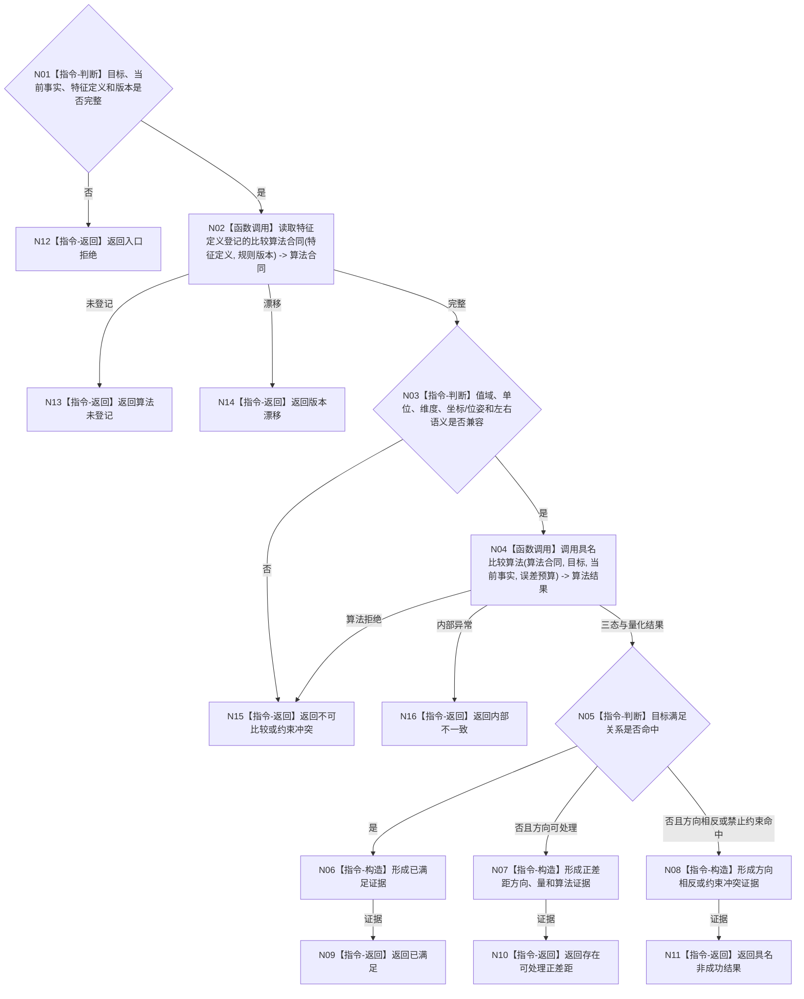

# BIZ-L3-004-01-02 按注册比较合同裁决目标差距目标函数流程图 v0.1

更新时间：2026-08-03

## 依据

```text
4130、4160、5100、6210；BIZ-L2-004-01、BIZ-L2-004-05
```

## 身份与边界

正式目标函数设计图。按特征定义登记的强类型判断收束合同比较目标与当前事实，返回方向和可审计差距；不存在“所有值统一减法”。

## 函数合同

```text
根函数：特征判断收束服务::按注册比较合同裁决目标差距
归属模块 / 文件 / 层级：特征判断收束 / 海中鱼巣/领域/服务.特征判断收束.ixx / L3
现有或待新增：待新增通用调度入口；可复用现有同域三态比较能力
完整签名：目标差距比较结果 特征判断收束服务::按注册比较合同裁决目标差距(const 目标差距比较请求& 请求) const
参数：请求为只读借用；含目标状态合同、当前事实、特征定义、比较算法身份、单位/维度、误差预算、左右语义和规则版本
返回结果：不可变值式结果；含已满足、存在可处理正差距、方向相反、约束冲突、不可比较、算法未登记、版本漂移或内部不一致，以及差距方向、量和比较证据
被调函数流程图：具名标量、向量、区间、集合、空间或判断型算法在登记后按需进入L4
父图：BIZ-L2-004-01、BIZ-L2-004-05；BIZ-L3-002-06-04复用本入口重判父需求当前目标事实
```

## 流程图



## 节点合同

| 节点 | 类型 | 输入 | 输出 | 事实读写 | 验证 |
| --- | --- | --- | --- | --- | --- |
| N02 | 函数调用 | 特征定义、规则版本 | 具名算法合同 | 只读定义登记 | 未登记必须拒绝 |
| N03/N04 | 判断 / 调用 | 类型化值和算法 | 三态与安全量化 | 无 | 单位、维度、误差、溢出 |
| N05—N16 | 判断 / 返回 | 算法结果和满足关系 | 目标差距结果 | 无写入 | 满足、正差距、反向、冲突分离 |

## 关键边界

差值方向由算法合同和左右语义冻结；角度、旋转、集合、轮廓、点云和图关系不得普通减法。比较结果不发布状态、需求或任务事实。
