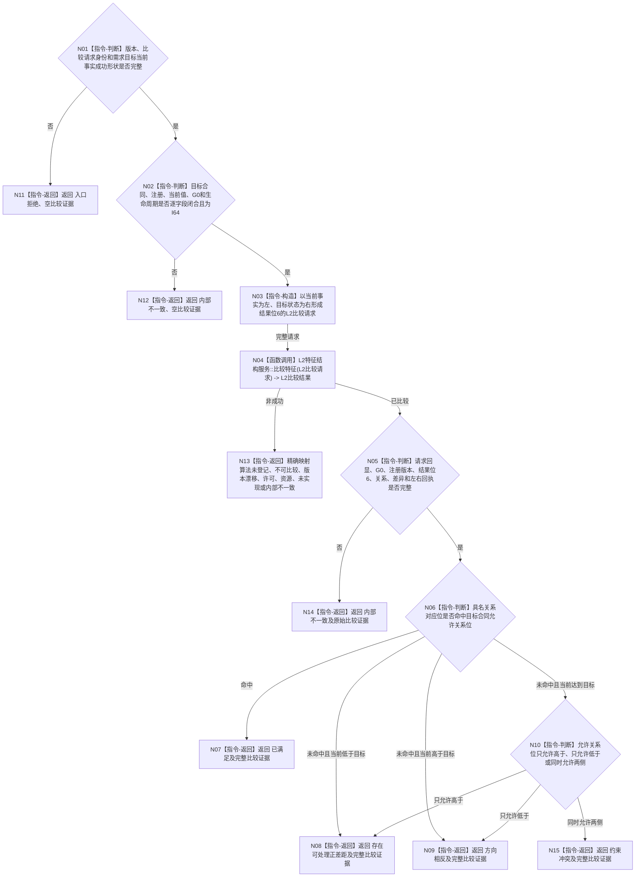

# BIZ-L3-004-01-02 按注册比较合同裁决目标差距目标函数流程图 v0.2

更新时间：2026-08-16

## 依据

```text
0050、3100、4160、4180、5100
BIZ-L2-004-01、BIZ-L2-004-05
BIZ-L3-004-01-01 v0.3
L2特征结构服务::比较特征
```

## 身份与边界

正式目标函数设计图。函数只消费一份已经闭合的 `需求目标当前事实结果`，从其中唯一目标合同、目标判断比较注册和当前 I64 值构造一次 DATA 比较请求，再把注册算法返回的具名关系与目标合同允许关系位收束为已满足、可处理正差距、方向相反或约束冲突。

v0.2 正式替代 v0.1 的“BIZ 先读算法合同再调用具名算法”和“三态与量化结果”路由。现行 DATA 统一入口在同一 `G0` 内自行读取当前唯一注册；BIZ 不重复读取注册、不选择算法、不请求排序三态。父 BIZ-L2 合同要求差距方向、差距量与完整比较结果，因此请求结果位固定为 `具名关系 | 差异材料`，差异不可表示时返回不可比较，不能降级为仅关系成功。

## 函数合同

```text
根函数：特征判断收束服务::按注册比较合同裁决目标差距
归属模块 / 文件 / 层级：海中鱼巣.领域.服务.特征判断收束 / 海中鱼巣/领域/服务.特征判断收束.ixx / BIZ-L3
现有或待新增：待新增 provider-only 服务；只持一个 const L2特征结构服务&
完整签名：目标差距比较结果 特征判断收束服务::按注册比较合同裁决目标差距(const 目标差距比较请求& 请求) const noexcept
参数：请求为只读借用；含本函数合同 / 规则版本、非零比较请求身份和完整成功的需求目标当前事实结果
返回结果：值式结果；业务裁决携带完整 L2特征比较结果，入口拒绝在 DATA 调用前零比较证据，其它 DATA 非成功保留原始结构化比较结果
被调函数：L2特征结构服务::比较特征(const L2特征比较请求&) const
父图：BIZ-L2-004-01、BIZ-L2-004-05；BIZ-L2-002-06 v0.2 只通过BIZ-L2-004-06复用，不建立重复比较入口
```

## 流程图



## 节点合同

| 节点 | 类型 | 参数 / 输入绑定 | 结果 / 输出绑定 | 事实读写 | 验证 |
| --- | --- | --- | --- | --- | --- |
| N01/N02 | 本函数内判断 | 请求、父结果及两份子材料 | 入口完整或内部闭合 | 无 | 不接受空 optional、混合 G0、错定义、错注册、非 I64 或非当前生命周期 |
| N03 | 本函数内构造 | 当前值、目标 I64、目标合同、注册合同和比较请求身份 | `L2特征比较请求` | 无 | 左当前事实、右目标状态；算法族 / 版本来自注册；结果位恰为6 |
| N04 | 函数调用 | 完整 `L2特征比较请求` | `L2特征比较结果` | DATA 内部只读当前注册 | 恰一次调用；零 BIZ 注册预读、零重试、零截止重选 |
| N05 | 本函数内判断 | 原请求、父材料、DATA结果 | 完整比较证据 | 无 | G0、注册、算法、位6、元数据和左右回执逐字段相等 |
| N06—N10 | 本函数内裁决 | 具名关系、允许关系位和完整差异材料 | 四类业务裁决 | 无 | 关系位映射固定为低1、等2、高4；不以裸差异替代关系 |

## 关键边界

- 唯一 DATA 调用是 `L2特征结构服务::比较特征`；BIZ 不读取比较注册、不直达算法函数、不复制 DATA CRUD。
- 比较用途固定为目标判断；左角色固定当前事实，右角色固定目标状态，差异方向固定右减左；调用方不能交换角色或选择算法。
- DATA 的 `差异不可表示`和注册不允许结果位6均映射不可比较。原始类型、单位、维度、左右角色、请求身份或输入版本在父材料已经闭合后仍冲突，映射内部不一致。
- 具名关系命中允许关系位即已满足。未命中时，低于目标为可处理正差距，高于目标为方向相反；达到目标但只允许高于 / 低于分别沿相应方向，低与高同时允许而等于不允许时为约束冲突。
- 完整 `L2特征比较结果`是唯一比较审计证据；不得建立需求领域简化比较 DTO，不得把裸 I64 差值直接当作业务事实。
