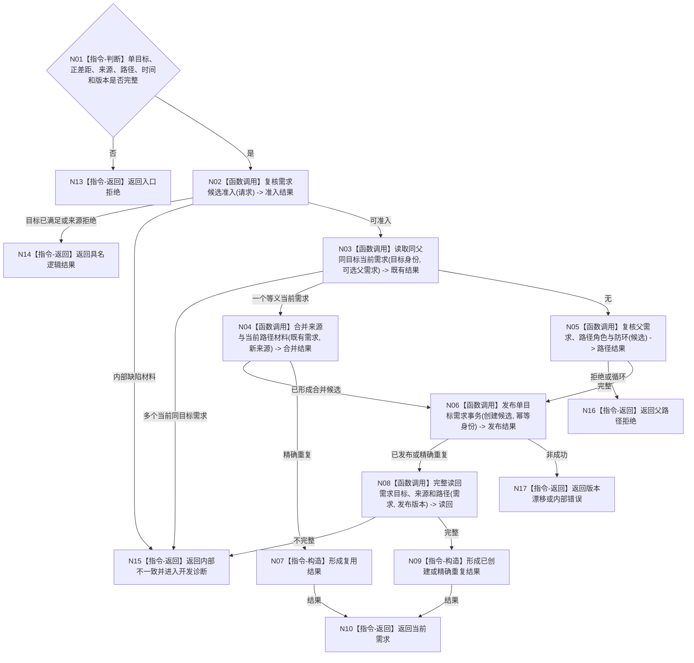

# BIZ-L3-004-02-01 提交或复用单目标需求目标函数流程图 v0.1

更新时间：2026-08-03

## 依据

```text
3100、5100、5110、5130、5150；BIZ-L2-004-02
```

## 身份与边界

正式目标函数设计图。需求领域统一校验并创建、复用或合并一个单目标需求；不创建任务，不接受日志或显示文本作为身份。

## 函数合同

```text
根函数：需求业务服务::提交或复用单目标需求
归属模块 / 文件 / 层级：需求领域 / 海中鱼巣/领域/服务.需求.ixx / L3
现有或待新增：适配扩展；复用创建完整目标状态需求，补父路径、目标去重和活动当前性
完整签名：单目标需求提交结果 需求业务服务::提交或复用单目标需求(const 单目标需求提交请求& 请求) const
参数：请求为只读借用；含正差距、主体、目标宿主/场景/特征/状态、可选父需求、路径角色、来源证据、授权、发生时间、规则版本和幂等身份
返回结果：不可变值式结果；含已创建、已复用、已合并、精确重复、目标已满足、父路径拒绝、来源拒绝、版本漂移或内部不一致，以及当前需求和路径版本
被调函数流程图：BIZ-L4-004-02-01-01、BIZ-L4-004-02-01-02、BIZ-L4-004-02-01-03、BIZ-L4-004-02-01-04、BIZ-L4-004-02-01-05、BIZ-L4-004-02-01-06，分别冻结候选准入、同父同目标读取、来源路径合并、父路径与防环、原子发布和完整读回
父图：BIZ-L2-004-02
```

## 流程图



## 节点合同

| 节点 | 类型 | 输入 | 输出 | 事实读写 | 验证 |
| --- | --- | --- | --- | --- | --- |
| N02/N03/N05 | 函数调用 | 候选和父路径 | 准入、去重、防环 | 只读需求事实 | 单目标、同父去重、无循环 |
| N04/N06/N08 | 函数调用 | 完整候选 | 合并候选、原子发布和读回 | 需求领域唯一写入 | 同义幂等、无半结构 |
| N07/N09/N10 | 构造 / 返回 | 发布结果 | 当前需求 | 无额外写入 | 来源与路径全保留 |

## 关键边界

同目标候选必须复用或合并，来源差异不能制造第二个需求身份。内部代码缺陷不得需求化；父子拓扑不能单独决定路径角色。
