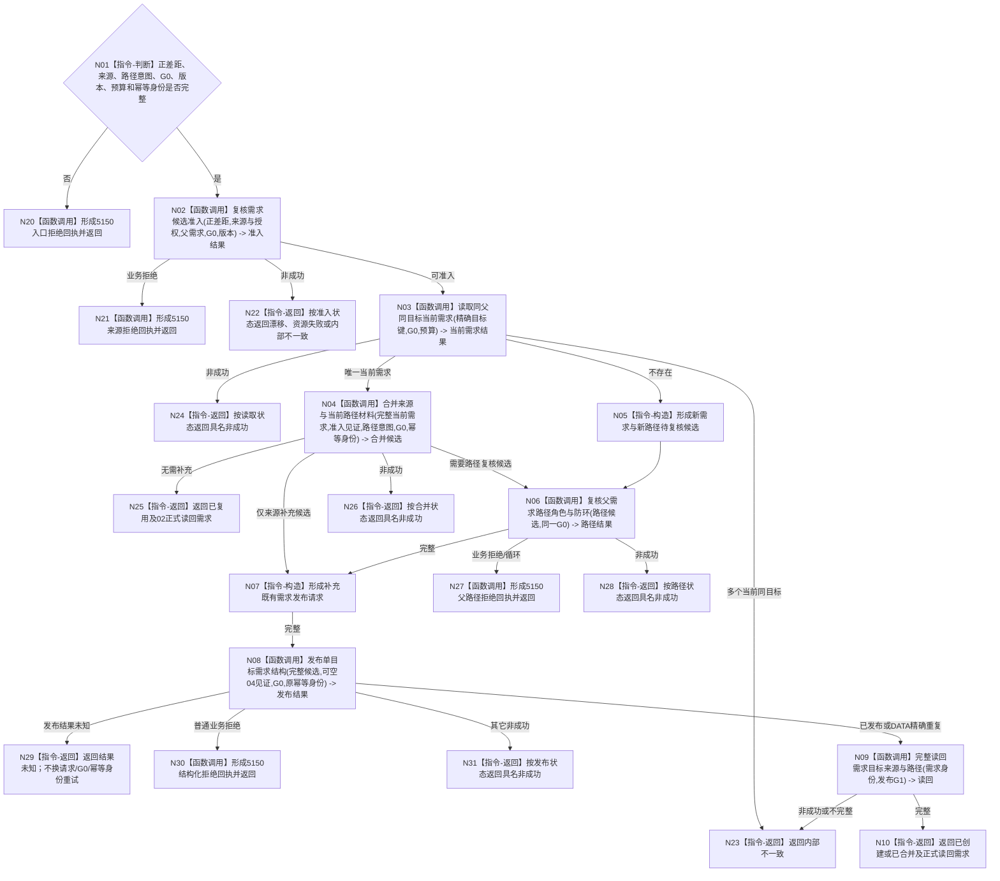

# BIZ-L3-004-02-01 提交或复用单目标需求目标函数流程图 v0.3

更新时间：2026-08-16

## 依据

```text
0050、3100、5100、5110、5130、5150；BIZ-L2-004-02；BIZ-L4-004-02-01-01 v0.3、02 v0.3、03 v0.2、05 v0.2
```

## 身份与边界

正式父函数增量替代图。保持01—04既有控制边，重基线05为只调用唯一 DATA-EXT-12公开结构写入口的BIZ消费函数；需求发布成功或精确重复后必须进入06正式读回。BIZ不建立数据操作层、事务参与者、L1写端口、私有发布见证或撤销链。

04和06仍需独立重基线；本图只冻结05的输入输出绑定与父级5150拒绝回执责任，整体仍不得施工。

## 函数合同

```text
根函数：需求业务服务::提交或复用单目标需求
归属模块 / 文件 / 层级：需求领域 / 海中鱼巣/领域/服务.需求.ixx / BIZ-L3
现有或待新增：适配扩展；01—03及05已冻结目标合同，04/06待重基线
完整签名：单目标需求提交结果 需求业务服务::提交或复用单目标需求(const 单目标需求提交请求& 请求) const noexcept
参数：已确认正差距、主体、单目标结构、可空父需求、路径意图、来源证据与授权、非零G0、版本、预算和原发布幂等身份
返回结果：已创建、已复用、已合并、无需补充、目标已满足、父路径拒绝、来源拒绝、当前性漂移、发布结果未知、资源失败或内部不一致；成功只携带06正式读回需求
被调函数流程图：BIZ-L4-004-02-01-01—06
父图：BIZ-L2-004-02
```

## 流程图



## 节点合同

| 节点 | 类型 | 输入 | 输出 | 事实读写 | 验证 |
| --- | --- | --- | --- | --- | --- |
| N02—N04 | 调用 | 正差距、来源见证、精确目标键、G0 | 准入、完整当前需求和补充候选 | 01/02只读，03纯值 | 同父同目标不因来源/路径不同创建第二需求 |
| N05—N07 | 构造 / 调用 | 新建或新增路径候选 | 完整发布请求 | 04只读 | 任一新增路径必须经过04；仅来源补充不伪造04见证 |
| N08 | 调用 | 一个完整BIZ发布请求 | DATA公开发布结果 | 只经DATA-EXT-12 | 零BIZ事务、L1、owner、撤销、内部写集 |
| N09/N10 | 调用 / 返回 | 需求身份与G1 | 06正式完整需求 | 只读DATA-EXT-12 | 05结果不代替正式读回；精确重复也必须读回 |
| N20/N21/N27/N30 | 调用 | 业务拒绝材料 | 5150正式回执 | 只写治理回执 | 01/04/05不各建第二回执写入口 |

## 关键边界

- 05只接收上游已经闭合的BIZ候选并调用唯一DATA公开写入口；任何DATA内部事务、参与者、写集和撤销都不进入BIZ。
- `已发布`和`精确重复`都只是05结果，必须使用返回的原G1进入06正式读回后才能形成父级成功。
- 5150拒绝回执由本父提交入口统一形成；内部不一致只进入诊断，不伪装普通拒绝。
- v0.2保留为历史；04、06未重基线前，本图不授权整体施工。
