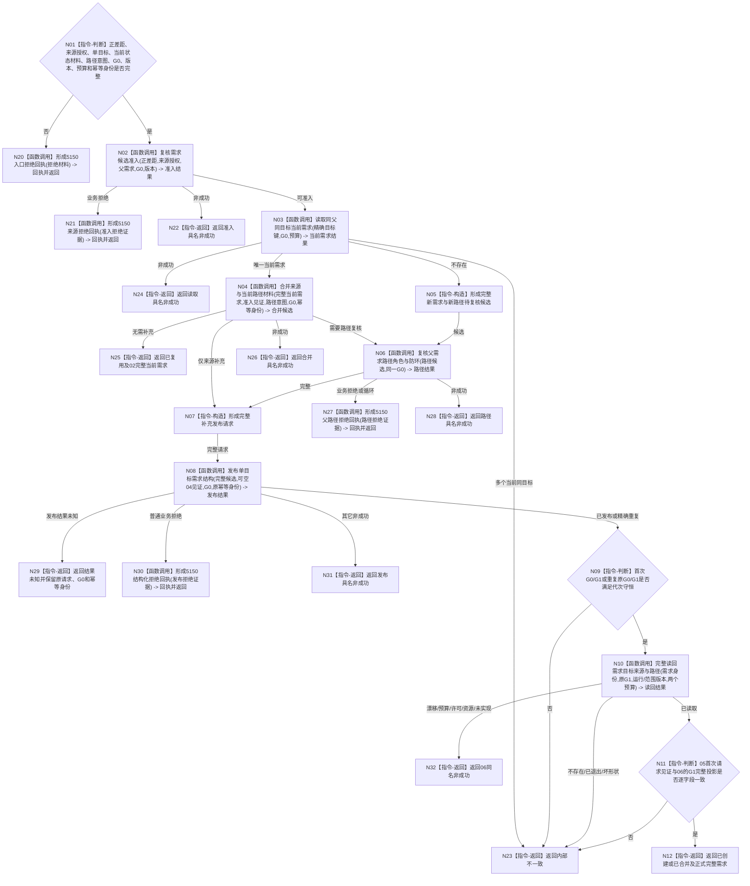

# BIZ-L3-004-02-01 提交或复用单目标需求目标函数流程图 v0.4

更新时间：2026-08-16

## 依据

```text
0050、3100、4015、4030、4050、4230、5100、5110、5130、5150；
BIZ-L4-004-02-01-01 v0.3、02 v0.3、03 v0.2、05 v0.2、06 v0.2；
DEMAND-SINGLE-TARGET-STRUCTURE-READBACK-CONSUME v0.1详细设计
```

## 身份与边界

历史需求形成设计候选，已退出 `BIZ-L2-004-02 v0.2` 当前父图，待后续重归属到需求形成链；不得由T03的具体D承接入口调用。v0.4 冻结的05成功 / 精确重复三代次分账、06历史完整读回和父级逐字段互证只在完成重归属后继续有效：首次发布写前代次为G0，原写后历史截止为G1，06调用时当前读取守卫为G读。05首次发布必须满足`G1=G0+1`；精确重复沿用原G0 / G1且零推进。06只按需求身份和G1读取权威结构，不接收BIZ私有见证；父函数独立比较05首次请求见证与06的G1完整投影。

04仍待独立重基线；当前状态材料、满足关系、路径权重、AND份额 / 余量版本和预算来源必须在04 / 05 / DATA-EXT-12最终合同中补齐。本图及父函数整体保持待施工，不把待实现DATA ABI冒充当前能力。

## 函数合同

```text
根函数：需求业务服务::提交或复用单目标需求
归属模块 / 文件 / 层级：需求领域 / 海中鱼巣/领域/服务.需求.ixx / BIZ-L3
现有或待新增：适配扩展；01—03、05、06目标合同已冻结，04及跨叶字段仍待闭合
完整签名：单目标需求提交结果 需求业务服务::提交或复用单目标需求(const 单目标需求提交请求& 请求) const noexcept
参数：已确认正差距、主体、单目标、当前状态材料、满足关系、可空父需求、来源授权、路径意图及权重 / 分配 / 预算、非零G0、版本、预算和原发布幂等身份
返回结果：已创建、已复用、已合并、无需补充、目标已满足、父路径拒绝、来源拒绝、当前性漂移、数量预算不足、提供者拒绝、发布结果未知、资源失败或内部不一致；发布成功只携带经06读回并由父级互证的完整需求
被调函数流程图：BIZ-L4-004-02-01-01—06；本版新增引用BIZ-L4-004-02-01-06 v0.2
父图：无；已退出BIZ-L2-004-02，待需求形成链重归属
```

## 流程图



## 节点合同

| 节点 | 类型 | 参数 / 输入绑定 | 结果 / 输出绑定 | 事实读写 | 后继条件 | 验证 |
| --- | --- | --- | --- | --- | --- | --- |
| N02—N04 | 函数调用 | 正差距、来源见证、精确目标键、G0 | 准入、完整当前需求、补充候选 | 01 / 02只读，03纯值 | 同父同目标不因来源或路径不同产生第二需求 | 01—03既有目标合同 |
| N05—N07 | 构造 / 调用 | 新建或新增路径候选 | 含当前状态材料、满足关系、权重 / 分配 / 预算的完整发布请求 | 04只读 | 任一新增路径经04；仅来源补充不伪造04见证 | 04最终重基线门禁 |
| N08/N09 | 调用 / 判断 | 完整BIZ发布请求、G0 | DATA发布结果、原G0/G1 | 只经DATA-EXT-12写 | 首次`G1=G0+1`；精确重复沿用原G0/G1 | 零BIZ事务、L1、owner、撤销 |
| N10 | 函数调用 | 需求身份、原G1、版本、两个预算 | 06历史读回结果 | 只读运行期事实版本服务和DATA-EXT-12 | 06内部另取G读；不携带05见证 | G读守卫与G1历史截止分账 |
| N11/N12 | 判断 / 返回 | 05首次请求见证、06完整G1投影 | 父级成功结果 | 无新增事实写 | 全字段、全组、全代次一致 | 建立 / 补充 / 精确重复矩阵 |
| N20/N21/N27/N30 | 函数调用 | 业务拒绝材料 | 5150正式回执 | 只写治理回执 | 普通业务拒绝 | 01 / 04 / 05 / 06不各建回执写入口 |

## 关键边界

- DATA结构读取合同不接收BIZ首次请求见证、业务资格或业务结论；读取按需求身份、G读守卫和G1历史截止返回完整不可变结构，父级自行互证。
- 05发布结果未知时不调用06；只有原请求最终收敛为已发布或精确重复且G0/G1守恒后才进入06。
- 06的漂移、预算、许可、资源和未实现保持具名非成功；在05已成功前提下，G1未找到、已退出、缺项、混代或结构矛盾升级内部不一致。
- 5150只承接普通业务拒绝；发布后结构矛盾进入开发诊断，不形成普通拒绝回执。
- v0.3保留为历史。04以及当前状态材料、满足关系和路径权重 / 分配 / 预算合同未闭合前，父函数整体不得施工。
