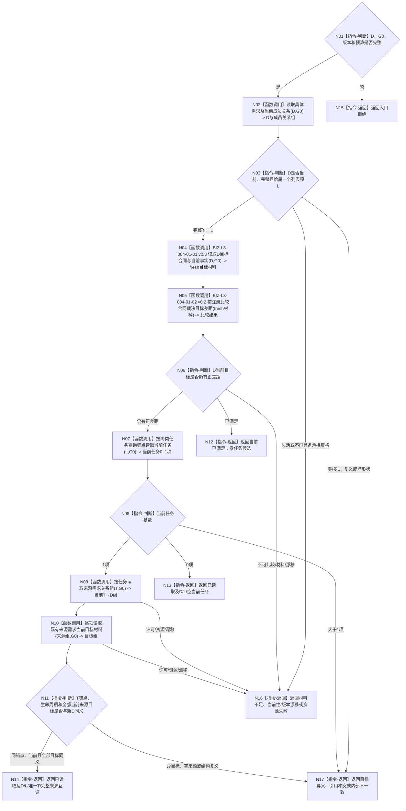

# BIZ-L3-004-02-02 读取具体需求及同类任务当前承接目标函数流程图 v0.2

更新时间：2026-08-27

## 依据与替代

```text
0050、3100、3200、4260 v0.9、5090、5200 v0.9
BIZ-L2-004-02 v0.2
BIZ-L3-004-01-01 v0.3、BIZ-L3-004-01-02 v0.2
```

本图完整替代 v0.1“读取当前任务树”。旧图从来源需求反查整棵任务父子树、选择唯一零父根并读取治理存在；正式合同已经退出任务父子业务拓扑。当前函数只为一个具体需求 `D` 读取其所属列表项 `L`，以 `L` 查询 `0..1` 个当前任务，并在唯一任务存在时互证当前 `T→D` 来源目标。

## 身份与边界

正式目标函数设计图。函数在同一非零 `G0` 读取 `D`、当前成员关系、目标合同与当前事实，并以 `L` 读取当前任务。它可以裁决“D当前已满足，因此无需任务”，但不创建需求、任务、存在、关系、状态或筹办事实。

## 函数合同

```text
根函数：读取具体需求及同类任务当前承接
归属模块 / 文件 / 目标分解深度：任务承接组合 / 海中鱼巣/领域/组合.任务承接.ixx / BIZ-L3
现有或待新增：待新增；组合正式需求读取、目标fresh读取和任务结构读取
完整签名：具体需求当前承接读取结果 任务承接组合器::读取具体需求及同类任务当前承接(const 具体需求当前承接读取请求& 请求) const noexcept
参数：请求只读借用；含具体需求D、来源G0、需求/成员/目标/比较/任务结构合同版本和总预算；不得携带调用方声明的L、当前T、目标比较结论或列表成员组
返回结果：已读取、当前已满足、无需承接、材料不足、当前性/版本漂移、目标异义、引用冲突、资源失败或内部不一致；完整载荷携带D、唯一L、0..1当前T、T全部当前来源关系与逐来源目标互证、共同截止G0
被调函数流程图：复用BIZ-L3-004-01-01/02读取并比较D目标；本图后继的DATA读取叶在下一BIZ-L4校正批展开
父图：BIZ-L2-004-02 v0.2
```

## 流程图



## 节点合同

| 节点 | 类型 | 输入 | 输出 | 事实读写 | 验证 |
| --- | --- | --- | --- | --- | --- |
| N01—N03 | 判断 / 函数调用 | D、G0、版本、预算 | D及唯一当前L | 只读需求和当前成员关系 | 0/1/N成员关系、退出、混代、坏owner |
| N04—N06 | 函数调用 / 判断 | D与G0 | 当前已满足或仍有正差距 | 只读目标合同与当前世界事实；纯值比较 | 必须复用统一目标读取/比较，不从选择见证缓存结论 |
| N07/N08 | 函数调用 / 判断 | 正式L、G0 | 0..1当前T | 只读task owner查询锚点关系 | 0合法、1唯一、N内部不一致 |
| N09—N11 | 函数调用 / 判断 | 唯一T、新D、G0 | 完整当前来源与目标同义结论 | 只读T→D和逐需求目标 | 至少一项当前来源；逐项同义、无列表成员补齐 |
| N12—N17 | 返回 | 结构化读取结果 | 完整材料或具名非成功 | 无写入 | 非成功零承接候选 |

## 关键边界

- 调用方不得提供 `L` 或当前 `T`；二者必须由同一 `G0` 的正式读回得到。
- `0`个当前任务是完整成功材料，不等于需求不存在；`>1`个当前任务是内部不一致，禁止挑最新或最小身份。
- 唯一当前任务必须至少有一条当前正式 `T→D`，且全部当前来源目标与新D完全同义；不得用L聚合目标、任务缓存或旧私有目标副本补齐。
- 本函数不读取任务父子树、运行态治理存在、调度资格、现实授权或方法候选。

## 当前代码实现对照

- HEAD仍以`L2任务事实.需求列表项`和`按需求列表项读取当前任务`返回0..1任务，没有正式改名后的锚点合同、T→D组读回或逐来源目标互证。
- HEAD运行期组合仍可从列表成员聚合任务来源，违反本图“只有正式T→D为来源”的边界。
- 因而本目标函数尚未实现；旧v0.1整树读取及其零父根/子任务拓扑语义不再属于004-02当前父图。
