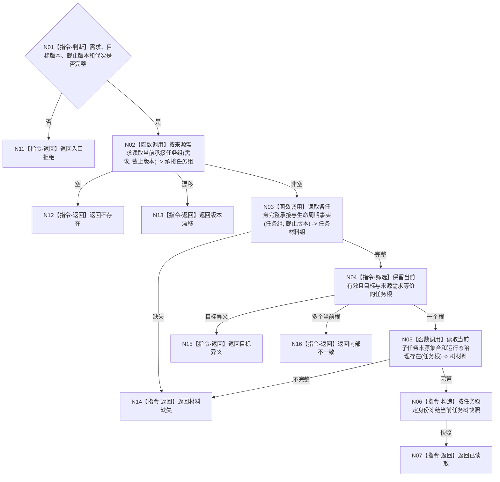

# BIZ-L3-004-02-02 读取当前任务树目标函数流程图 v0.1

更新时间：2026-08-03

## 依据

```text
3200、5090、5200、5210；BIZ-L2-004-02
```

## 身份与边界

正式目标函数设计图。按来源需求读取其当前唯一任务树、目标等价来源、运行态治理存在和可调度任务；只读当前关系，不以历史任务推断当前树。

## 函数合同

```text
根函数：任务业务服务::读取当前任务树
归属模块 / 文件 / 层级：任务领域 / 海中鱼巣/领域/服务.任务.ixx / L3
现有或待新增：适配扩展；组合现有任务权威材料读取并增加需求反向承接枚举
完整签名：当前任务树读取结果 任务业务服务::读取当前任务树(const 当前任务树读取请求& 请求) const
参数：请求为只读借用；含来源需求、目标合同版本、事实截止版本、任务树规则版本和运行代次
返回结果：不可变值式结果；含不存在、已读取、材料缺失、目标异义、多个当前根、版本漂移或内部不一致，以及任务根、当前任务组、全部目标等价来源、运行态治理存在和状态版本
被调函数流程图：BIZ-L4-004-02-02-01、BIZ-L4-004-02-02-02、BIZ-L4-004-02-02-03，分别冻结来源需求反向承接读取、任务完整承接与生命周期读取、当前子任务/来源/唯一治理存在读取
父图：BIZ-L2-004-02
```

## 流程图



## 节点合同

| 节点 | 类型 | 输入 | 输出 | 事实读写 | 验证 |
| --- | --- | --- | --- | --- | --- |
| N02/N03/N05 | 函数调用 | 需求和截止版本 | 承接、生命周期、树材料 | 只读任务领域 | 当前关系、唯一治理存在 |
| N04 | 指令 | 任务材料 | 当前根 | 无 | 目标等价、唯一当前树 |
| N06/N07 | 构造 / 返回 | 树材料 | 稳定快照 | 无写入 | 全量来源保留 |

## 关键边界

不同目标任务不是同一任务树；同一来源需求历史任务可以保留但不得冒充当前根。任务列表位置、创建时间和UI树形结构不参与唯一性。
