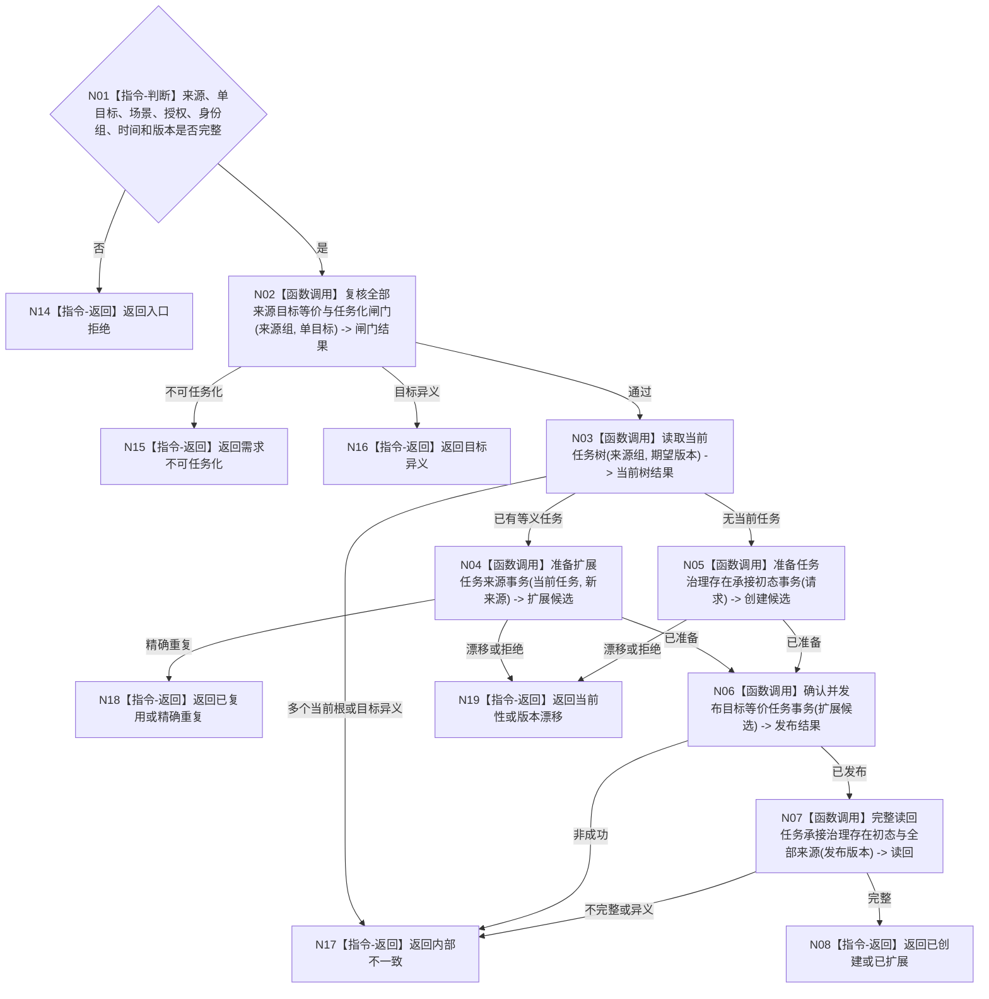

# BIZ-L3-004-02-03 创建或扩展目标等价任务目标函数流程图 v0.1

更新时间：2026-08-03

## 依据

```text
3200、5090、5110、5200、5210、5230；BIZ-L2-004-02
```

## 身份与边界

正式目标函数设计图。任务领域原子创建单目标任务树根，或把新的目标等价来源需求扩展到既有当前任务；不筹办、不选择方法。

## 函数合同

```text
根函数：任务业务服务::创建或扩展目标等价任务
归属模块 / 文件 / 层级：任务领域 / 海中鱼巣/领域/服务.任务.ixx / L3
现有或待新增：适配扩展；复用创建承接任务，新增多来源等价校验和唯一当前树幂等收束
完整签名：目标等价任务提交结果 任务业务服务::创建或扩展目标等价任务(const 目标等价任务提交请求& 请求)
参数：请求为只读借用；含一个或多个来源需求、单一目标、运行场景、授权、路径/权重/预算引用、任务/治理存在/初态幂等身份、发生时间和期望版本
返回结果：不可变值式结果；含已创建、已扩展、已复用、精确重复、需求不可任务化、目标异义、当前性漂移、版本漂移或内部不一致，以及任务、治理存在、初始状态、全部来源和发布版本
被调函数流程图：BIZ-L4-004-02-03-01、BIZ-L4-004-02-03-02、BIZ-L4-004-02-03-03、BIZ-L4-004-02-03-04、BIZ-L4-004-02-03-05，分别冻结任务化闸门、来源扩展候选、任务创建候选、统一确认发布和完整读回；当前树查询复用BIZ-L3-004-02-02
父图：BIZ-L2-004-02
```

## 流程图



## 节点合同

| 节点 | 类型 | 输入 | 输出 | 事实读写 | 验证 |
| --- | --- | --- | --- | --- | --- |
| N02/N03 | 函数调用 | 来源、目标、版本 | 闸门和当前树 | 只读需求/任务事实 | 单目标、来源等价、唯一树 |
| N04—N07 | 函数调用 | 完整请求 | 原子任务结构和读回 | 任务领域唯一写入 | 唯一治理存在、全来源保留 |
| N08/N14—N19 | 返回 | 提交状态 | 结构化结果 | 无额外写入 | 幂等、漂移、异义分离 |

## 关键边界

任务创建只建立承接、唯一运行态治理存在和初始状态；筹办、方法选择、执行冻结和结果必须由后继入口形成。并发同义请求只能得到一个当前任务树。
