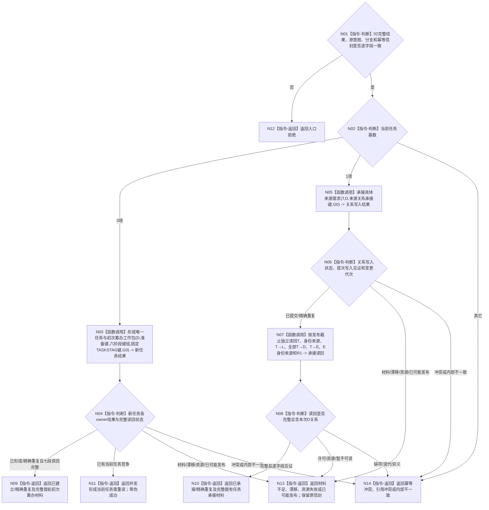

# BIZ-L3-004-02-03 提交具体需求任务承接并完整读回目标函数流程图 v0.2

更新时间：2026-08-27

## 依据与替代

```text
0050、3200、4260 v0.9、5090、5200 v0.9
20260824_TASK-ROUND-INITIAL-STATE-ARCH-L2-MIGRATION v0.2详细设计
BIZ-L2-004-02 v0.2、BIZ-L3-004-02-02 v0.2
```

本图完整替代 v0.1“创建或扩展目标等价任务”。旧图建立任务治理存在、任务父子树和目标副本，并把多个owner包装为一个任务事务；这些语义全部退出。当前函数只消费一个D的完整当前承接材料，并按“无当前T / 唯一当前T”调用两条不同的正式写入链。

## 身份与边界

正式目标函数设计图。新任务分支复用 `需求初次筹办准备提供者::形成唯一任务与初次筹办工作包` 的目标合同，以原准备键和六阶段键组逐owner建立并读回；既有任务分支只调用 `L2任务结构服务::承接具体来源需求`，使用独立来源关系承接键新增或精确重复 `T→D`。两分支不得互换幂等键或副作用。

## 函数合同

```text
根函数：提交具体需求任务承接并完整读回
归属模块 / 文件 / 目标分解深度：任务承接组合 / 海中鱼巣/领域/组合.任务承接.ixx / BIZ-L3
现有或待新增：待新增；复用待迁移的新任务初次筹办provider与待实现的task来源关系公开面
完整签名：具体需求任务承接提交结果 任务承接组合器::提交具体需求任务承接并完整读回(const 具体需求任务承接提交请求& 请求) noexcept
参数：请求只读借用；含BIZ-L3-004-02-02完整读取结果、原具体需求承接意图、分支种类和原完整幂等信封；不得携带调用方构造的T/L/E/R1或阶段结果
返回结果：已建立并形成首轮初次筹办、已承接、精确重复、并发形成当前任务需重读、入口拒绝、材料不足、当前性/版本漂移、已可能发布、幂等冲突、引用冲突、资源失败或内部不一致；成功载荷为公开入口完整读回
被调函数流程图：BIZ-L4-004-02-03-06 v0.1形成新任务六阶段完整工作包；07 v0.1为既有任务承接具体来源需求；08 v0.1完整读回既有任务新增来源承接
父图：BIZ-L2-004-02 v0.2
```

## 流程图



## 节点合同

| 节点 | 类型 | 输入 | 输出 | 事实读写 | 验证 |
| --- | --- | --- | --- | --- | --- |
| N01/N02 | 判断 | 02结果、原意图、分支、原信封 | 新建或复用候选 | 无写入 | D/L/G0/版本/键逐字段一致 |
| N03/N04 | 函数调用 / 判断 | D、准备键、六阶段键组及固定TASKSTAG定义键 | 新任务全链结果 | 只经具名领域服务由存在、task核心、特征定义/实例、状态、P1/A1、动态各owner分段发布业务事实并读回 | 准备键=P1键；六键不派生/不替换；TASKSTAG不占六键；七段截止分账 |
| N05/N06 | 函数调用 / 判断 | 唯一T、D、来源关系承接键、G0 | T→D写入结果 | 只经L2任务结构服务由task owner原子写入一条T→D关系 | 同键同义/同一关系精确重复；异义冲突 |
| N07/N08 | 函数调用 / 判断 | 正式发布截止与身份 | 完整任务承接读回 | 只读task/存在公开面 | T/L/D/E/R1、身份来源、生命周期、代次和关系端点全互证 |
| N09—N14 | 返回 | 分支结果 | 结构化成功、恢复或失败 | 无额外写入 | 非成功空成功载荷；原请求/键可恢复 |

## 关键边界

- 新任务分支不使用“来源关系承接键”另写第二条 `T→D`；首条关系已经在任务核心键的同一task-owner写集中形成。
- 既有任务分支不消费准备键或六阶段键，不得重建E、R1、首态、P1/A1或第一动态。
- `已可能发布`只保留原请求、原键和提交见证继续收敛，不能改走另一分支、换键或重做已成功owner阶段。
- 兼容`L2任务虚拟存在身份`只可包装正式E稳定编码；没有`T→E`与E身份来源联合读回时不能形成成功。
- 发布返回不是完整性证明；成功必须有独立读回，且所有非成功都不得携带可冒充完整任务承接结果的半结构。

## 当前代码实现对照

- 发布源码新任务provider仍是单任务键、task-owner私有虚拟存在和旧融合写集；与六阶段/正式E/R1/状态动态分owner目标合同不一致。
- 发布源码没有`承接具体来源需求`及其按原关系键收敛、正式来源组读回和正式E/R1读回生产实现。
- 因而本图两个分支均为待实现目标；BIZ-L4-004-02-03-06—08 已冻结必要目标叶，旧v0.1“目标等价任务事务”及其L4叶不再属于本父函数。
