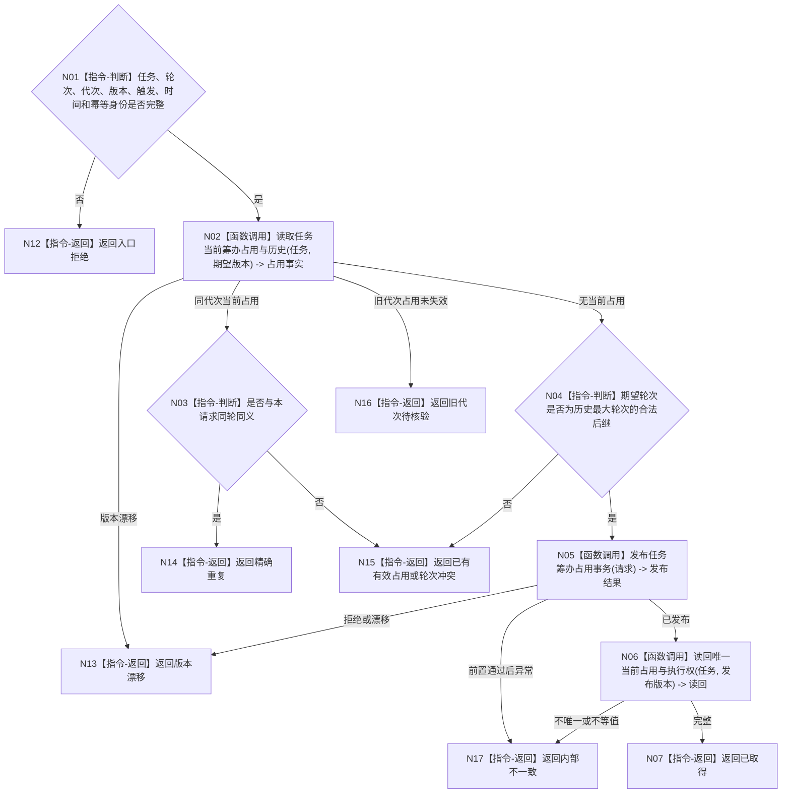

# BIZ-L3-004-03-01 取得任务筹办执行权目标函数流程图 v0.1

更新时间：2026-08-03

## 依据

```text
3200、5210、5230、5090；BIZ-L2-004-03
```

## 身份与边界

正式目标函数设计图。按任务稳定身份、筹办轮次和运行代次原子取得唯一筹办占用与执行权；不读取方法候选，不保存裸线程编号。

## 函数合同

```text
根函数：任务筹办服务::取得任务筹办执行权
归属模块 / 文件 / 层级：任务筹办 / 海中鱼巣/领域/服务.任务筹办.ixx / L3
现有或待新增：待新增；现行任务生命周期能力不等于筹办占用合同
完整签名：任务筹办执行权结果 任务筹办服务::取得任务筹办执行权(const 任务筹办执行权请求& 请求)
参数：请求为只读借用；含任务、期望筹办轮次、运行代次、期望任务/占用版本、触发事实、发生时间和幂等身份
返回结果：不可变值式结果；含已取得、精确重复、已有有效占用、旧代次待核验、轮次冲突、版本漂移、入口拒绝或内部不一致，以及独占执行权身份、占用版本和失效条件
被调函数流程图：BIZ-L4-004-03-01-01、BIZ-L4-004-03-01-02、BIZ-L4-004-03-01-03，分别冻结占用历史读取、筹办占用原子发布和唯一当前执行权读回
父图：BIZ-L2-004-03
```

## 流程图



## 节点合同

| 节点 | 类型 | 输入 | 输出 | 事实读写 | 验证 |
| --- | --- | --- | --- | --- | --- |
| N02—N04 | 调用 / 判断 | 任务、轮次、代次 | 占用资格 | 只读任务治理事实 | 同任务单执行权、轮次单调 |
| N05/N06 | 函数调用 | 完整请求 | 占用发布及读回 | 任务领域原子写入 | 当前唯一、同义幂等 |
| N07/N12—N17 | 返回 | 占用状态 | 结构化结果 | 无额外写入 | 旧代次、冲突、漂移分离 |

## 关键边界

旧运行代次占用不能按超时、进程号或线程号直接删除或继承。无法证明前轮动作停止或已完成实际回读时，只能等待核验，不能取得新执行冻结。
