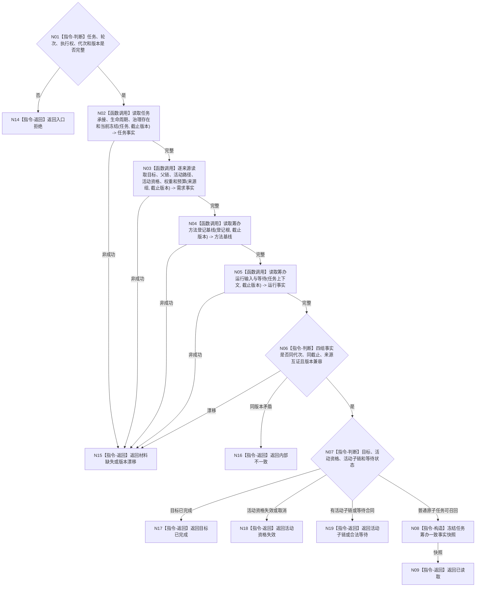

# BIZ-L3-004-03-02 读取任务筹办一致事实目标函数流程图 v0.1

更新时间：2026-08-03

## 依据

```text
3100、3200、5090、5200、5210、5230、5300；BIZ-L2-004-03
```

## 身份与边界

正式目标函数设计图。读取一个筹办轮次所需的任务、需求、路径、活动资格、方法、世界输入和等待事实，冻结为同一事实截止版本的一致快照；不召回或选择方法，也不读取冻结后普通派发调度材料。

## 函数合同

```text
根函数：运行期只读查询组合器::读取任务筹办一致事实
归属模块 / 文件 / 层级：运行期只读查询组合 / 海中鱼巣/领域/组合.运行期只读查询.ixx / L3
现有或待新增：适配扩展；现行只读组合缺完整筹办视图
完整签名：任务筹办一致事实结果 运行期只读查询组合器::读取任务筹办一致事实(const 任务筹办一致事实请求& 请求) const
参数：请求为只读借用；含任务、筹办轮次、执行权身份、运行代次、事实截止版本、任务/需求/方法/世界/等待规则版本
返回结果：不可变值式结果；含已读取、目标已完成、活动资格失效、已有活动子链、合法等待、材料缺失、版本漂移或内部不一致，以及5230每轮筹办输入全集
被调函数流程图：任务承接/生命周期/治理存在复用BIZ-L4-004-02-02-02、BIZ-L4-004-02-02-03，筹办执行权复用BIZ-L4-004-03-01-03；逐来源需求目标复用BIZ-L3-004-01-01，父链/活动路径复用BIZ-L3-004-11-03；BIZ-L4-004-03-02-01、BIZ-L4-004-03-02-02 v0.2分别冻结方法登记基线和运行输入/等待读取
父图：BIZ-L2-004-03
```

## 流程图



## 节点合同

| 节点 | 类型 | 输入 | 输出 | 事实读写 | 验证 |
| --- | --- | --- | --- | --- | --- |
| N02—N05 | 函数调用 | 任务和固定截止 | 四组权威事实 | 只读各领域服务 | 不跨版本补齐、全来源保留 |
| N06/N07 | 判断 | 四组事实 | 当前筹办分支 | 无 | 目标、活动资格、路径和等待分账 |
| N08/N09 | 构造 / 返回 | 完整事实 | 不可变快照 | 无写入 | 执行权与轮次绑定 |

## 关键边界

只读组合器不直达仓库，也不使用缓存、SQL、日志或线程状态补齐。需求权重、任务基础优先级和预算保持独立字段；6150/6170调度材料在执行冻结完成后的003-03路径 fresh 读取，不进入筹办一致事实。
