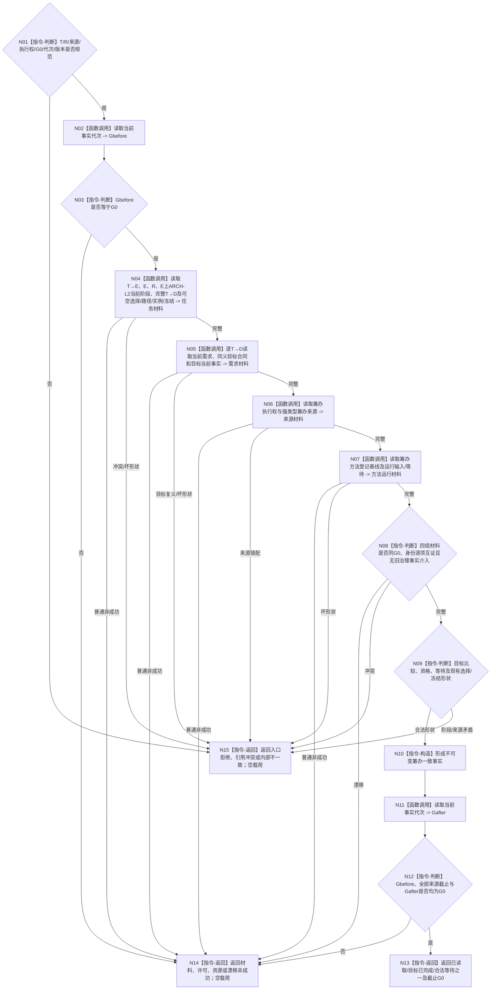

# BIZ-L3-004-03-02 读取任务筹办一致事实目标函数流程图 v0.2

更新时间：2026-08-28

## 依据与替代

```text
3100、3200、4230、4260 v0.9、5090 v0.7、5210、5230 v1.2、5300；BIZ-L2-004-03 v0.2
```

本图替代 v0.1。旧图读取“任务承接、生命周期、治理存在和当前冻结”，会让旧任务私有治理存在/状态重新参与当前裁决。v0.2只读取正式任务关系、任务专属ARCH-L2存在E、当前任务轮次、E上的ARCH-L2阶段/业务状态段、完整 `T→D` 与当前选择/路径/实例/冻结可空材料。

## 身份与边界

正式目标函数设计图。在请求固定的非零 `G0` 前后守卫下，组合读取当前筹办所需正式事实，不召回或选择方法，不读取普通派发调度、正向现实执行授权或线程状态。旧任务治理状态只可作为历史兼容材料，不能与ARCH-L2当前选择冲突时参与裁决。

## 函数合同

```text
根函数：运行期只读查询组合器::读取任务筹办一致事实
归属模块 / 文件 / 目标分解深度：运行期只读查询组合 / 海中鱼巣/领域/组合.运行期只读查询.ixx / BIZ-L3
现有或待新增：适配扩展；HEAD无完整同G0筹办视图
完整签名：任务筹办一致事实结果 运行期只读查询组合器::读取任务筹办一致事实(const 任务筹办一致事实请求& 请求) const noexcept
参数：T、R、强类型筹办来源、筹办执行权、运行代次、G0及任务/需求/方法/世界/等待规则版本
返回结果：已读取、目标已完成、活动资格失效、合法等待、材料不足、当前性/版本漂移、许可/资源失败、引用冲突或内部不一致；成功载荷为同G0不可变事实包
被调函数流程图：复用004-11当前任务完整读取、004-01目标当前事实、004-03-01执行权读回、004-03-02-01方法登记基线及004-03-02-02 v0.2运行输入/等待
父图：BIZ-L2-004-03 v0.2
```

## 流程图



## 关键边界

- 当前阶段只来自E上具名ARCH-L2特征实例的当前状态选择；旧任务治理状态、生命周期枚举、缓存和线程槽不能补位。
- `T→D` 必须按正式关系完整读取，不能从需求身份向量补造关系事实；各需求目标必须逐项同义，否则返回引用冲突。
- 6150/6170调度、正向现实执行授权、技术许可和硬否决均不进入本筹办读取。
