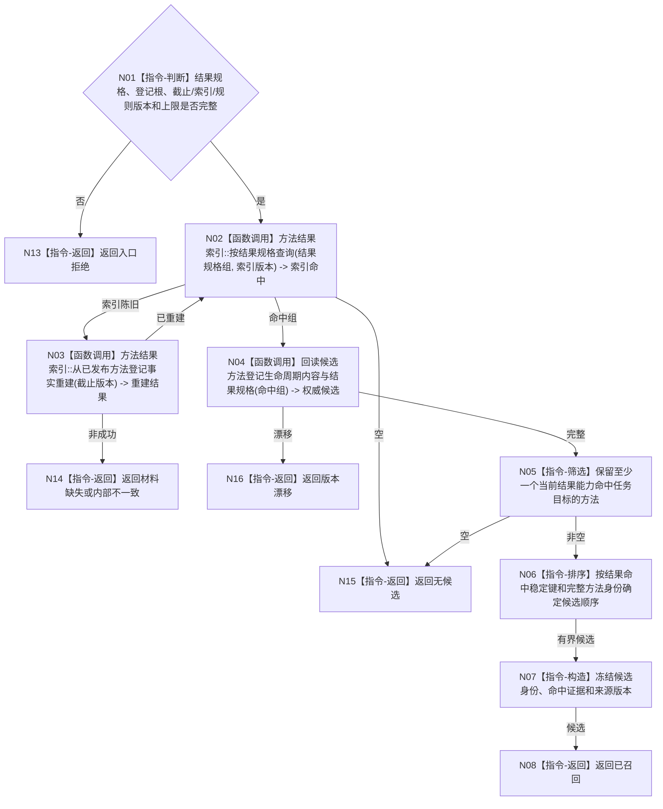

# BIZ-L3-004-03-04 按结果能力召回方法目标函数流程图 v0.1

更新时间：2026-08-03

## 依据

```text
3300、5250、5300、5090；BIZ-L2-004-03 v0.2
```

## 身份与边界

正式目标函数设计图。直接用任务目标合同中的可验证结果规格查询方法结果索引，再回读方法登记、生命周期和结果规格形成非权威候选起点；不先读取或构造候选方法条件，不选择方法，不提交任务事实。

## 函数合同

```text
根函数：方法召回业务服务::按结果能力召回方法
归属模块 / 文件 / 目标分解深度：方法召回 / 海中鱼巣/领域/服务.方法召回.ixx / BIZ-L3
现有或待新增：适配扩展；复用现行索引重建、候选回读和稳定排序
完整签名：方法结果能力召回结果 方法召回业务服务::按结果能力召回方法(const 方法结果能力召回请求& 请求) const
参数：请求为只读借用；含任务目标合同及其可验证结果规格组、方法登记根、事实截止版本、索引发布版本、召回规则版本和数量上限
返回结果：不可变值式结果；含已召回、无候选、索引陈旧已重建、材料缺失、版本漂移或内部不一致，以及稳定有序的候选方法与结果能力命中证据
被调函数流程图：BIZ-L4-004-03-04-01、BIZ-L4-004-03-04-02、BIZ-L4-004-03-04-03，分别冻结结果索引查询、从已发布方法登记事实完整重建索引、候选方法权威事实回读
父图：BIZ-L2-004-03 v0.2
```

## 流程图



## 节点合同

| 节点 | 类型 | 输入 | 输出 | 事实读写 | 验证 |
| --- | --- | --- | --- | --- | --- |
| N02/N03 | 函数调用 | 结果规格、索引版本 | 索引命中或重建 | 索引非权威、登记事实只读 | 清空重建不改变方法事实 |
| N04/N05 | 调用 / 筛选 | 索引命中 | 权威复判候选 | 只读方法领域 | 生命周期、内容版本、结果命中 |
| N06—N08 | 指令 / 返回 | 候选 | 稳定有界结果 | 无写入 | 不按名称、函数名或固定编号 |

## 关键边界

索引命中只提供候选起点。方法首、通用特征写入、状态创建、任务筹办及被动/提交/结算动作不得因名称相似进入主动候选。只有本函数已经权威回读成立的候选方法，后继才可读取其条件、输入、参数和相关因果证据。
