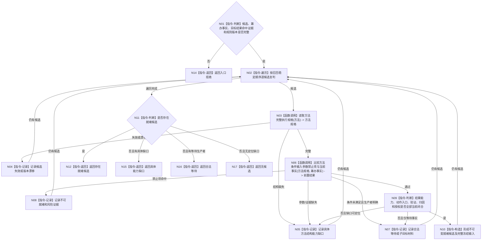

# BIZ-L3-004-03-05 复核候选条件结果动作入口与当前事实目标函数流程图 v0.1

更新时间：2026-08-03

## 依据

```text
5250、5300、5230、4190、4310；BIZ-L2-004-03
```

## 身份与边界

正式目标函数设计图。逐候选复核方法条件、结果、动作入口、参数、禁止项、验证、归因、授权和当前事实，形成就绪候选或具名缺口；不选择或执行方法。

## 函数合同

```text
根函数：方法候选复判服务::复核候选条件结果动作入口与当前事实
归属模块 / 文件 / 层级：方法候选复判 / 海中鱼巣/领域/服务.方法候选复判.ixx / L3
现有或待新增：待新增；现行召回复判不足以形成5230完整执行冻结输入
完整签名：方法候选就绪链结果 方法候选复判服务::复核候选条件结果动作入口与当前事实(const 方法候选就绪链请求& 请求) const
参数：请求为只读借用；含已经按目标结果能力召回并权威回读的初始候选、任务筹办一致事实、事实截止版本、候选复判/风险/验证规则版本
返回结果：不可变值式结果；含存在就绪候选、无候选、合法等待、具体能力缺口、版本漂移或内部不一致，以及逐候选条件、参数、动作入口、结果、风险、验证和归因材料
被调函数流程图：BIZ-L4-004-03-05-01、BIZ-L4-004-03-05-02，分别冻结方法完整执行规格读取和条件/输入/参数/禁止项当前事实比较
父图：BIZ-L2-004-03
```

## 流程图



## 节点合同

| 节点 | 类型 | 输入 | 输出 | 事实读写 | 验证 |
| --- | --- | --- | --- | --- | --- |
| N03/N06 | 函数调用 | 候选和筹办事实 | 方法规格、前置比较 | 只读方法/世界事实 | 全规格、同截止、参数闭合 |
| N07—N10 | 指令 | 复判材料 | 等待、缺口、风险或就绪候选 | 无 | 缺口角色和生产者具名 |
| N11—N17 | 判断 / 返回 | 全候选复判 | 就绪链结果 | 无写入 | 无候选不自动建方法首 |

## 关键边界

本函数只能在候选方法已经召回并权威回读后读取其条件；不得从因果线索或目标状态凭空生成条件。执行期才暴露的既有缺方法、动作入口、条件结果对、参数或写回入口缺口，证明本函数漏检并属于内部错误；不能在执行期补造后继续。
