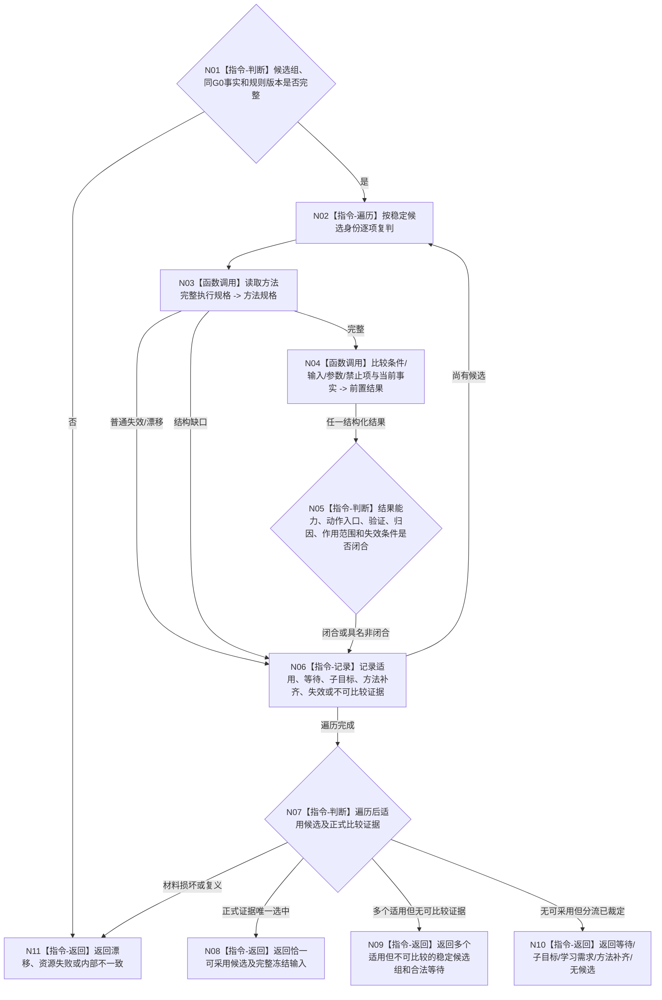

# BIZ-L3-004-03-05 复核候选条件结果动作入口与当前事实目标函数流程图 v0.2

更新时间：2026-08-28

## 依据与替代

```text
4190、4230、5230 v1.2、5250、5300；BIZ-L2-004-03 v0.2
```

本图替代 v0.1。旧图把“授权闭合”列入候选就绪和执行冻结输入；v0.2删除该前置。筹办只复核方法自身条件、输入、参数、禁止项、结果能力、动作入口、验证、归因、作用范围和失效条件。正向现实执行授权、6150/6170调度、技术许可与硬否决均在冻结形成后分账处理。

## 函数合同

```text
根函数：方法候选复判服务::复核候选条件结果动作入口与当前事实
归属模块 / 文件 / 目标分解深度：方法候选复判 / 海中鱼巣/领域/服务.方法候选复判.ixx / BIZ-L3
现有或待新增：待新增目标组合
完整签名：方法候选就绪链结果 方法候选复判服务::复核候选条件结果动作入口与当前事实(const 方法候选就绪链请求& 请求) const noexcept
参数：已按结果能力召回且权威回读的候选组、004-03-02 v0.2同G0事实和复判规则版本
返回结果：恰一可采用候选、多个适用但不可比较、合法等待、子目标、学习需求、方法补齐、无适用候选、漂移、资源失败或内部不一致；载荷保持全候选和逐项证据
被调函数流程图：BIZ-L4-004-03-05-01/02 v0.1；比较和排序为本函数内纯值步骤
父图：BIZ-L2-004-03 v0.2
```

## 流程图



## 关键边界

- 稳定编码只用于规范排序，不能充当能力优劣；没有正式比较证据不得选首项。
- 候选组不是实例组。只有N08的一个选中候选可交004-03-06发布路径、实例和冻结。
- 方法适用不等于已获正向现实执行授权或普通派发资格。
