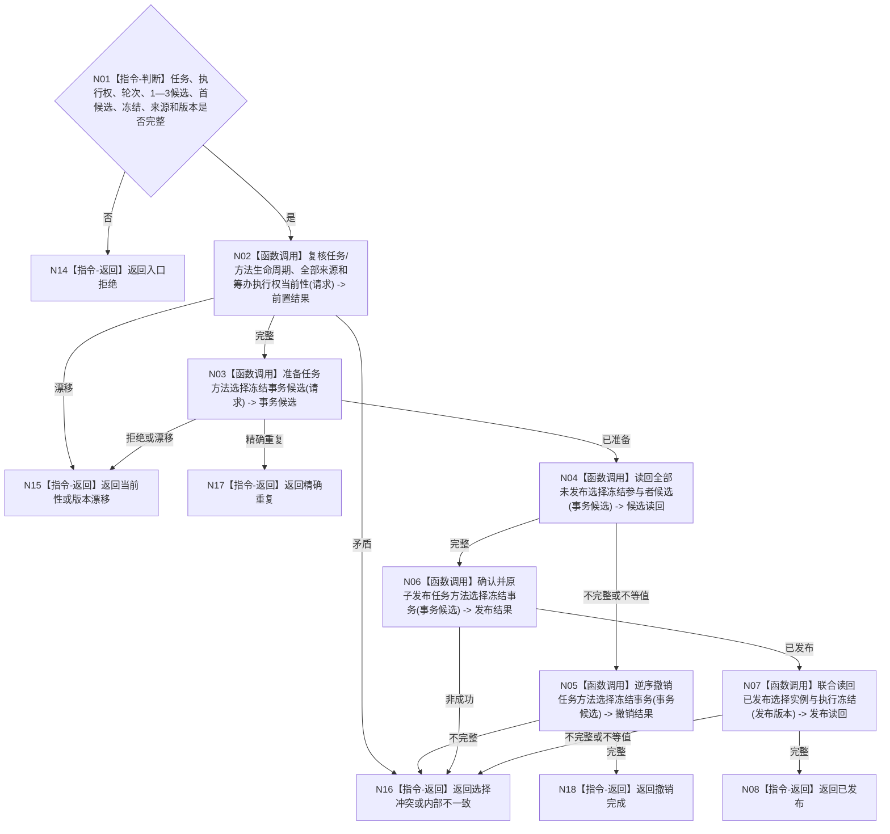

# BIZ-L3-004-03-06 发布任务方法选择与执行冻结目标函数流程图 v0.1

更新时间：2026-08-03

## 依据

```text
3200、4010、4020、5200、5210、5230、5300；BIZ-L2-004-03
```

## 身份与边界

正式目标函数设计图。由任务领域把本轮1—3个实例候选、唯一当前选择、完整执行冻结及来源互证原子发布；不开始方法动作，不建立独立筹办回执。

## 函数合同

```text
根函数：任务业务服务::发布任务方法选择与执行冻结
归属模块 / 文件 / 层级：任务领域 / 海中鱼巣/领域/服务.任务.ixx / L3
现有或待新增：适配扩展；复用现行任务方法选择记录，补候选实例、完整冻结和多来源联合事务
完整签名：任务方法选择冻结发布结果 任务业务服务::发布任务方法选择与执行冻结(const 任务方法选择冻结发布请求& 请求)
参数：请求为只读借用；含任务、筹办执行权、轮次、有序1—3候选、首候选、完整冻结、全部来源需求/权限、任务与方法生命周期事实、发生时间、规则版本和幂等身份组
返回结果：不可变值式结果；含已发布、精确重复、选择冲突、当前性漂移、版本漂移、撤销完成或内部不一致，以及选择记录、实例候选组、执行冻结、发布版本和联合读回
被调函数流程图：BIZ-L4-004-03-06-01、BIZ-L4-004-03-06-02、BIZ-L4-004-03-06-03、BIZ-L4-004-03-06-04、BIZ-L4-004-03-06-05，分别冻结事务候选准备、未发布候选读回、逆序撤销、确认/原子发布和发布后联合读回
父图：BIZ-L2-004-03
```

## 流程图



## 节点合同

| 节点 | 类型 | 输入 | 输出 | 事实读写 | 验证 |
| --- | --- | --- | --- | --- | --- |
| N02 | 函数调用 | 选择请求 | 当前性前置 | 只读任务/方法事实 | 关系14/23、来源、执行权互证 |
| N03—N07 | 函数调用 | 完整选择与冻结 | 原子事务和联合读回 | 任务领域唯一写入 | 关系16角色、1—3候选、全确认/撤销 |
| N08/N14—N18 | 返回 | 发布状态 | 结构化结果 | 无额外写入 | 同轮幂等、异义冲突、无半冻结 |

## 关键边界

同一任务同一轮次只有完整结构完全同义才允许幂等；重复筹办必须形成新轮次和新记录。执行结果不得事后补配或反写本轮候选、选择、方法内容、动作入口或冻结。
