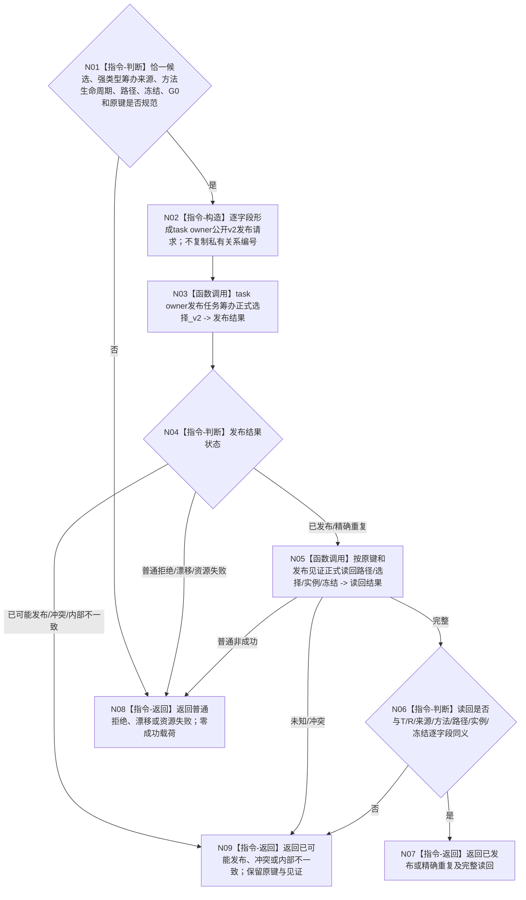

# BIZ-L3-004-03-06 发布任务方法选择与执行冻结目标函数流程图 v0.2

更新时间：2026-08-28

## 依据与替代

```text
3200、4230、4260 v0.9、5230 v1.2、5300；BIZ-L2-004-03 v0.2
```

本图替代 v0.1及其旧五叶事务展开。旧图准备1—3实例候选、依赖固定关系16角色30—34/40，并把权限写入冻结；这些均违反现行task owner强类型选择记录和“一轮只执行一个实例”边界。旧BIZ-L4-004-03-06-01—05退出当前树，仅作历史草图。

## 身份与边界

正式目标函数设计图。只把已经由004-03-05 v0.2用正式比较证据选中的恰一方法，机械映射为task owner公开发布请求。task owner是路径、选择记录、选择拓扑、派生当前路径、当前实例关联和执行绑定冻结材料的唯一业务写入者；内部治理组合器不复制固定关系编号、私有角色、事务候选或第二当前选择入口。

## 函数合同

```text
根函数：任务筹办发布组合器::发布任务方法选择与执行冻结
归属模块 / 文件 / 目标分解深度：任务筹办发布组合 / 海中鱼巣/领域/内部治理/服务.任务筹办当前就绪与执行冻结.ixx / BIZ-L3
现有或待新增：适配现有task owner v2选择发布入口；生产调用未闭合
完整签名：任务方法选择冻结发布结果 任务筹办发布组合器::发布任务方法选择与执行冻结(const 任务方法选择冻结发布请求& 请求) noexcept
参数：T、R、强类型初次/同轮后继筹办来源、恰一选中方法及其方法生命周期、路径材料、执行绑定冻结材料、G0、规则版本和原幂等身份
返回结果：已发布、精确重复、入口/许可拒绝、当前性/版本漂移、幂等/引用冲突、资源失败、已可能发布或内部不一致；成功载荷为task owner完整正式读回
被调函数流程图：task owner公开“发布任务筹办正式选择_v2”及其正式读回；不保留当前BIZ-L4私有事务叶
父图：BIZ-L2-004-03 v0.2
```

## 流程图



## 关键边界

- 本函数一次只发布一个路径、一个当前选择、一个实例和一份冻结；未选候选保持值式审计材料，不写入task owner。
- 执行冻结不含调度资格、正向现实执行授权、技术许可或安全硬否决结果。
- task owner发布成功不等于ARCH-L2阶段迁移、队列派发或方法动作开始；这些由后继各owner分账处理。
