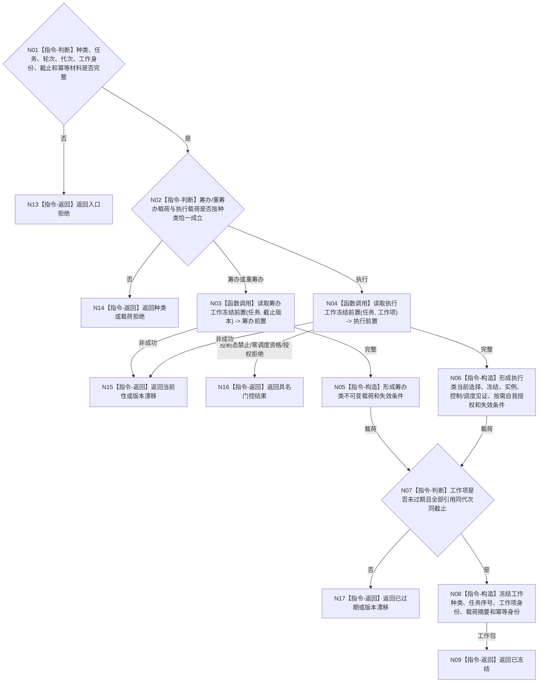

# BIZ-L3-004-04-01 冻结任务工作请求目标函数流程图 v0.1

更新时间：2026-08-03

## 依据

```text
3200、5090、5210、5230、5300、6170、8100；BIZ-L2-004-04
```

## 身份与边界

正式目标函数设计图。按强类型工作种类把任务、筹办轮次或当前选择 / 执行冻结 / 实例方法、生存控制、调度资格和按需自我授权冻结成不可变工作项；不入队、不迁移任务状态。

## 函数合同

```text
根函数：任务工作冻结服务::冻结任务工作请求
归属模块 / 文件 / 层级：任务工作冻结 / 海中鱼巣/领域/服务.任务工作冻结.ixx / L3
现有或待新增：适配扩展；复用现行执行请求冻结，新增筹办/重筹办工作包及统一工作身份
完整签名：任务工作冻结结果 任务工作冻结服务::冻结任务工作请求(const 任务工作调度请求& 请求) const
参数：请求为只读借用；含工作种类、任务、筹办轮次、运行代次、任务序号、工作项身份、事实截止版本、截止时间、幂等身份及对应互斥载荷
返回结果：不可变值式结果；含已冻结、种类/载荷拒绝、控制态禁止、零调度资格、授权拒绝、当前性漂移、版本漂移、已过期或内部不一致，以及不可变任务工作包和来源版本
被调函数流程图：BIZ-L4-004-04-01-01、BIZ-L4-004-04-01-02，分别冻结筹办/重筹办工作前置和执行工作选择/冻结/控制/调度/按需自我授权前置读取
父图：BIZ-L2-004-04
```

## 流程图



## 节点合同

| 节点 | 类型 | 输入 | 输出 | 事实读写 | 验证 |
| --- | --- | --- | --- | --- | --- |
| N02—N04 | 判断 / 调用 | 种类和任务 | 筹办或执行前置 | 只读任务/方法/控制/调度/自我授权事实 | 载荷互斥、现实改变按需授权 |
| N05—N08 | 指令 | 完整前置 | 不可变工作包 | 无 | 值式材料、同代次、失效条件 |
| N09/N13—N17 | 返回 | 冻结状态 | 结构化结果 | 无写入 | 拒绝、漂移、过期分离 |

## 关键边界

筹办包不得携带实例方法或现实执行授权；执行包必须绑定当前选择、完整冻结、当前实例方法、生存控制与调度资格见证，含现实改变时再绑定当前唯一自我授权。不存在旧通用执行令牌或旧许可账。工作包不得包含栈引用、锁、事务令牌或服务内部可变指针。
