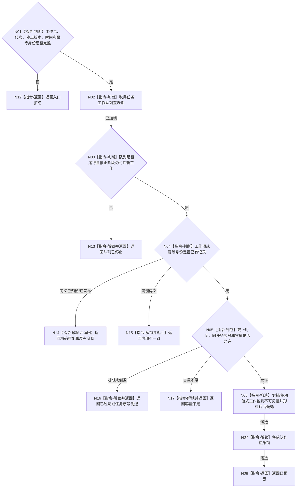

# BIZ-L3-004-04-02 准备强类型任务工作包目标函数流程图 v0.1

更新时间：2026-08-03

## 依据

```text
4050、5090、5230、8100；BIZ-L2-004-04 v0.2
```

## 身份与边界

正式目标函数设计图。在共享任务工作队列内为一个完整工作包预留不可见槽位；不调用领域服务，不让消费者看到半提交工作。

## 函数合同

```text
根函数：任务工作队列::准备强类型任务工作包
归属模块 / 文件 / 目标分解深度：任务工作队列 / 海中鱼巣/线程/任务工作队列.ixx / BIZ-L3
现有或待新增：适配扩展；复用现行强类型执行请求预留，扩展统一筹办/执行工作包
完整签名：任务工作包准备结果 任务工作队列::准备强类型任务工作包(const 不可变任务工作包& 工作包, const 任务工作包准备上下文& 上下文)
参数：工作包和上下文为只读借用；上下文含运行代次、停止阶段版本、当前时间、容量规则版本和幂等身份
返回结果：值式结果；含已预留、精确重复、队列已停止、容量不足、已过期、任务序号倒退、同键异义或内部不一致，以及独占可移动候选或既有发布身份
被调函数流程图：无；锁、容量、幂等和槽位均为队列内部指令
父图：BIZ-L2-004-04 v0.2
```

## 流程图



## 节点合同

| 节点 | 类型 | 输入 | 输出 | 事实读写 | 验证 |
| --- | --- | --- | --- | --- | --- |
| N02—N05 | 指令 | 工作包与队列状态 | 预留裁决 | 锁内队列元数据 | 停止、容量、幂等、单任务序号 |
| N06 | 指令 | 值式工作包 | 不可见候选 | 队列预留 | 消费者零可见 |
| N07/N08/N13—N17 | 指令 / 返回 | 预留状态 | 结构化结果 | 解锁 | 锁外返回 |

## 关键边界

队列槽位和预留代次只是内部能力，不进入业务身份。准备成功不表示任务已排队，也不允许工作线程消费。
