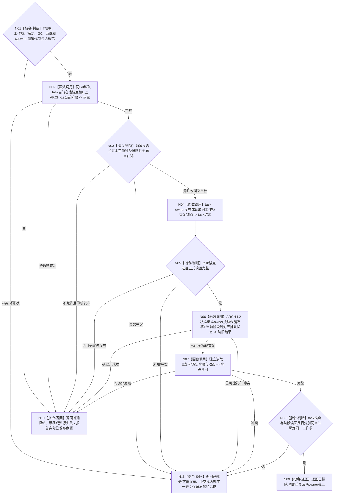

# BIZ-L3-004-04-03 分owner发布工作恢复锚点并迁移ARCH-L2阶段目标函数流程图 v0.2

更新时间：2026-08-28

## 依据与替代

```text
3200、4230、4260 v0.9、5210、5230 v1.2；BIZ-L2-004-04 v0.2
```

本图替代 v0.1“确认任务工作阶段进入排队”。旧图和其两个BIZ-L4叶把生命周期、阶段、恢复锚点和发布见证放进一个任务事务；旧BIZ-L4-004-04-03-01/02退出当前树。v0.2把task owner工作恢复锚点与E上ARCH-L2阶段迁移分成两个具名owner步骤并分别读回。

## 函数合同

```text
根函数：任务工作排队组合器::分owner发布工作恢复锚点并迁移ARCH-L2阶段
归属模块 / 文件 / 目标分解深度：任务工作排队组合 / 海中鱼巣/领域/内部治理/服务.任务阶段治理.ixx / BIZ-L3
现有或待新增：待新增目标组合；现有旧任务治理迁移不得复用为当前权威
完整签名：任务工作排队结果 任务工作排队组合器::分owner发布工作恢复锚点并迁移ARCH_L2阶段(const 任务工作排队请求& 请求) noexcept
参数：T/E/R、工作种类与工作项、冻结摘要、运行代次、来源G0、task锚点键、ARCH-L2迁移动作键和各owner期望代次
返回结果：已排队、精确重复、入口/许可拒绝、当前性/版本漂移、阶段拒绝、资源失败、已部分发布、已可能发布、冲突或内部不一致；成功载荷保存两owner独立见证与截止
被调函数流程图：task owner发布/读取工作恢复锚点；ARCH-L2状态动态服务发布原子迁移_v2并读取当前/历史；当前不保留专属BIZ-L4叶
父图：BIZ-L2-004-04 v0.2
```

## 流程图



## 关键边界

- 两个owner不共享G1。来源事实G0、task锚点读回截止和ARCH-L2阶段读回截止必须分账保存。
- task锚点已发布而阶段迁移失败时不是零写；重试只从阶段步骤继续。阶段已迁移后不得撤销为旧当前状态。
- 旧任务治理状态只作历史兼容读取；与ARCH-L2当前阶段冲突时必须服从ARCH-L2并报告旧值漂移。
