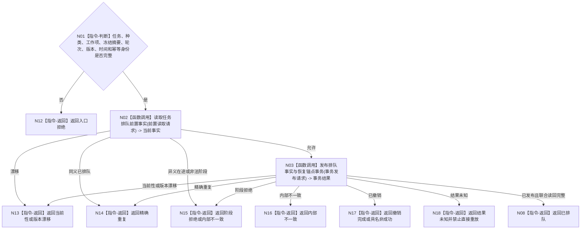

# BIZ-L3-004-04-03 确认任务工作阶段进入排队目标函数流程图 v0.1

更新时间：2026-08-03

## 依据

```text
3200、5210、5230、4050；BIZ-L2-004-04
```

## 身份与边界

正式目标函数设计图。任务领域把筹办或执行工作项身份、冻结摘要和派发种类绑定到任务的排队事实并原子发布；不操作线程队列。

## 函数合同

```text
根函数：任务业务服务::确认任务工作阶段进入排队
归属模块 / 文件 / 层级：任务领域 / 海中鱼巣/领域/服务.任务.ixx / L3
现有或待新增：适配扩展；复用现行执行排队迁移，增加筹办/重筹办种类及工作项恢复锚点
完整签名：任务工作阶段排队结果 任务业务服务::确认任务工作阶段进入排队(const 任务工作阶段排队请求& 请求)
参数：请求为只读借用；含任务、工作种类、工作项身份、冻结摘要、筹办轮次、预期当前生命周期/版本、发生时间、运行代次和幂等身份
返回结果：不可变值式结果；含已排队、精确重复、阶段拒绝、当前性漂移、版本漂移或内部不一致，以及排队生命周期事实、工作项恢复锚点和发布版本
被调函数流程图：BIZ-L4-004-04-03-01 读取任务排队前置事实；BIZ-L4-004-04-03-02 发布排队事实与恢复锚点事务
父图：BIZ-L2-004-04
```

## 流程图



## 节点合同

| 节点 | 类型 | 输入 | 输出 | 事实读写 | 验证 |
| --- | --- | --- | --- | --- | --- |
| N02 | 函数调用 | 前置读取请求 | 阶段、在途项与互斥事实 | 只读任务领域 | 同任务唯一在途工作；见BIZ-L4-004-04-03-01 |
| N03 | 函数调用 | 事务发布请求 | 生命周期、恢复锚点、发布见证和联合读回 | 任务领域原子写入 | 全确认/撤销、同义幂等；见BIZ-L4-004-04-03-02 |
| N08/N12—N18 | 返回 | 前置或事务状态 | 结构化结果 | 无额外写入 | 阶段拒绝、结果未知和内部错误分离 |

## 关键边界

恢复锚点必须足以重建同一个不可变工作包，但不得保存队列地址或候选令牌。任务排队只证明派发事实已发布，不证明队列确认、工作线程取出或业务执行。
