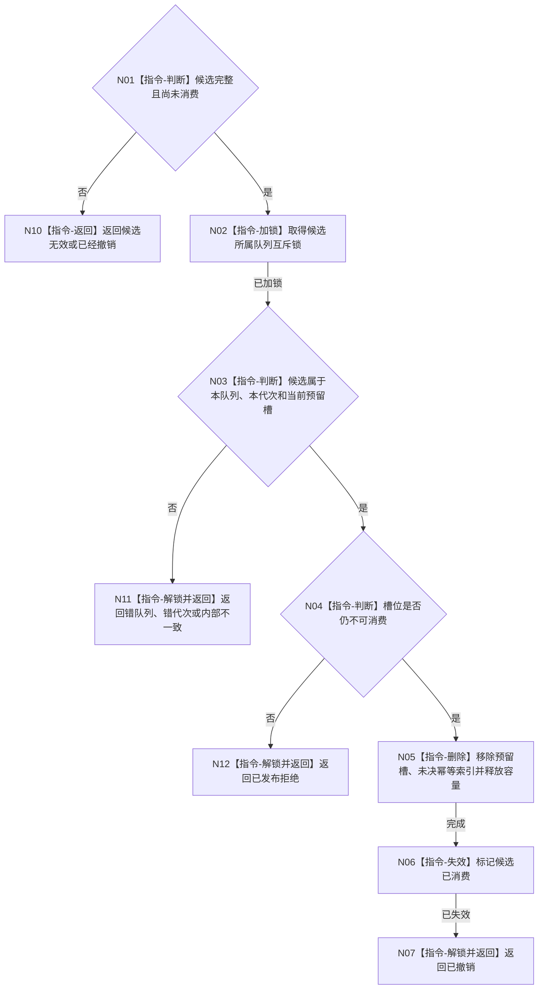

# BIZ-L3-004-04-04 撤销强类型任务工作包目标函数流程图 v0.1

更新时间：2026-08-03

## 依据

```text
4050、5090、5230、8100；BIZ-L2-004-04
```

## 身份与边界

正式目标函数设计图。撤销尚不可消费的任务工作包候选并释放容量；不倒退任务阶段，不撤销已发布工作包。

## 函数合同

```text
根函数：任务工作队列::撤销强类型任务工作包
归属模块 / 文件 / 层级：任务工作队列 / 海中鱼巣/线程/任务工作队列.ixx / L3
现有或待新增：适配扩展；复用现行执行请求候选撤销
完整签名：任务工作包撤销结果 任务工作队列::撤销强类型任务工作包(任务工作包候选&& 候选) noexcept
参数：候选为独占右值；仅在同队列、同代次、已预留且未确认时合法，调用后失效
返回结果：值式结果；含已撤销、已经撤销、候选无效、错队列、错代次、已发布拒绝或内部不一致，以及释放容量和工作项身份
被调函数流程图：无；全部为队列内部指令
父图：BIZ-L2-004-04
```

## 流程图



## 节点合同

| 节点 | 类型 | 输入 | 输出 | 事实读写 | 验证 |
| --- | --- | --- | --- | --- | --- |
| N02—N04 | 指令 | 候选 | 所属和可见性 | 锁内队列元数据 | 同队列、同代次、未发布 |
| N05/N06 | 指令 | 预留槽 | 容量释放和令牌失效 | 删除队列候选 | 无幽灵工作项 |
| N07/N10—N12 | 返回 | 撤销状态 | 结构化结果 | 解锁 | 不产生业务失败 |

## 关键边界

本函数仅用于任务排队发布失败前的队列预留回收；任务已经排队时不能靠撤销队列候选回滚业务事实，必须进入派发协调函数。

