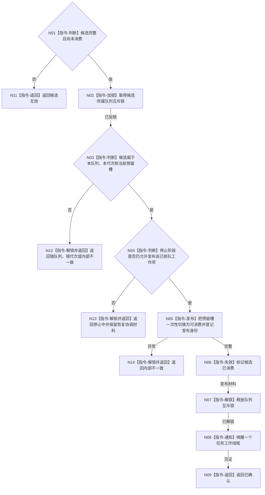

# BIZ-L3-004-04-05 确认强类型任务工作包目标函数流程图 v0.1

更新时间：2026-08-03

## 依据

```text
4050、5090、5230、8100；BIZ-L2-004-04
```

## 身份与边界

正式目标函数设计图。把一个已预留候选原子切换为唯一可消费工作包并通知工作线程池；不执行工作、不修改任务事实。

## 函数合同

```text
根函数：任务工作队列::确认强类型任务工作包
归属模块 / 文件 / 层级：任务工作队列 / 海中鱼巣/线程/任务工作队列.ixx / L3
现有或待新增：适配扩展；复用现行执行请求确认并扩展统一工作包
完整签名：任务工作包确认结果 任务工作队列::确认强类型任务工作包(任务工作包候选&& 候选)
参数：候选为独占右值；仅在同队列、同代次、已预留、未确认且停止阶段允许发布时合法，调用后失效
返回结果：值式结果；含已确认、精确重复、停止中、候选无效、错队列、错代次或内部不一致，以及发布身份、工作项身份和唤醒见证
被调函数流程图：无；可见性切换与通知为队列内部指令
父图：BIZ-L2-004-04
```

## 流程图



## 节点合同

| 节点 | 类型 | 输入 | 输出 | 事实读写 | 验证 |
| --- | --- | --- | --- | --- | --- |
| N02—N04 | 指令 | 候选和停止阶段 | 发布资格 | 锁内队列元数据 | 同队列、同代次、停止门 |
| N05/N06 | 指令 | 预留槽 | 唯一可消费项 | 队列可见性和幂等索引 | 单次确认 |
| N07—N09 | 指令 / 返回 | 发布材料 | 唤醒见证 | 锁外通知 | 通知不等于消费 |

## 关键边界

通知丢失必须由队列非空条件恢复，不得重复发布。确认失败发生在任务排队之后时，调用方必须用恢复锚点协调同一个工作项。
