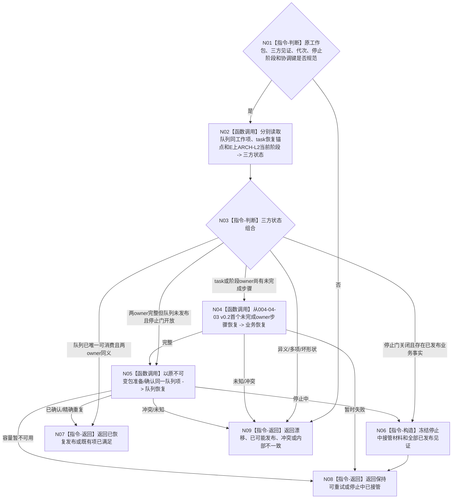

# BIZ-L3-004-04-06 协调已排队事实与未发布工作项目标函数流程图 v0.2

更新时间：2026-08-28

## 依据与替代

```text
3200、4230、5090 v0.7、5210、5230 v1.2、8100 v0.7；BIZ-L2-004-04 v0.2
```

本图替代 v0.1。旧图只读取一个“任务排队事实与恢复锚点”，默认它们同属一个任务事实事务。v0.2按队列、task恢复锚点和ARCH-L2阶段三个状态分账恢复；旧BIZ-L4-004-04-06-01—03不再作为当前闭合证明。

## 函数合同

```text
根函数：任务工作调度路由::协调已排队事实与未发布工作项
归属模块 / 文件 / 目标分解深度：任务工作调度 / 海中鱼巣/线程/路由.任务工作调度.ixx / BIZ-L3
现有或待新增：待新增恢复组合
完整签名：任务工作派发协调结果 任务工作调度路由::协调已排队事实与未发布工作项(const 任务工作派发协调请求& 请求) noexcept
参数：原不可变工作包、队列候选/发布身份、task锚点见证、ARCH-L2阶段见证、运行代次、停止阶段和原协调幂等身份
返回结果：已恢复发布、既有项已满足、保持可重试、停止中已接管、当前性/版本漂移、已可能发布、冲突或内部不一致；不倒退任何owner事实
被调函数流程图：读取队列同工作项；重放004-04-03 v0.2首个未完成owner步骤；复用004-04-02/05 v0.1发布同一队列项
父图：BIZ-L2-004-04 v0.2
```

## 流程图



## 关键边界

- 协调只恢复同一工作项，不建立第二包、第二锚点或第二阶段迁移。
- 已发布ARCH-L2阶段永不倒退；task锚点和队列状态只决定恢复位置，不裁决阶段真实性。
- 停止时若任一业务owner已经发布，必须交接原工作项与见证；不得撤销队列候选后宣称全程零写。
