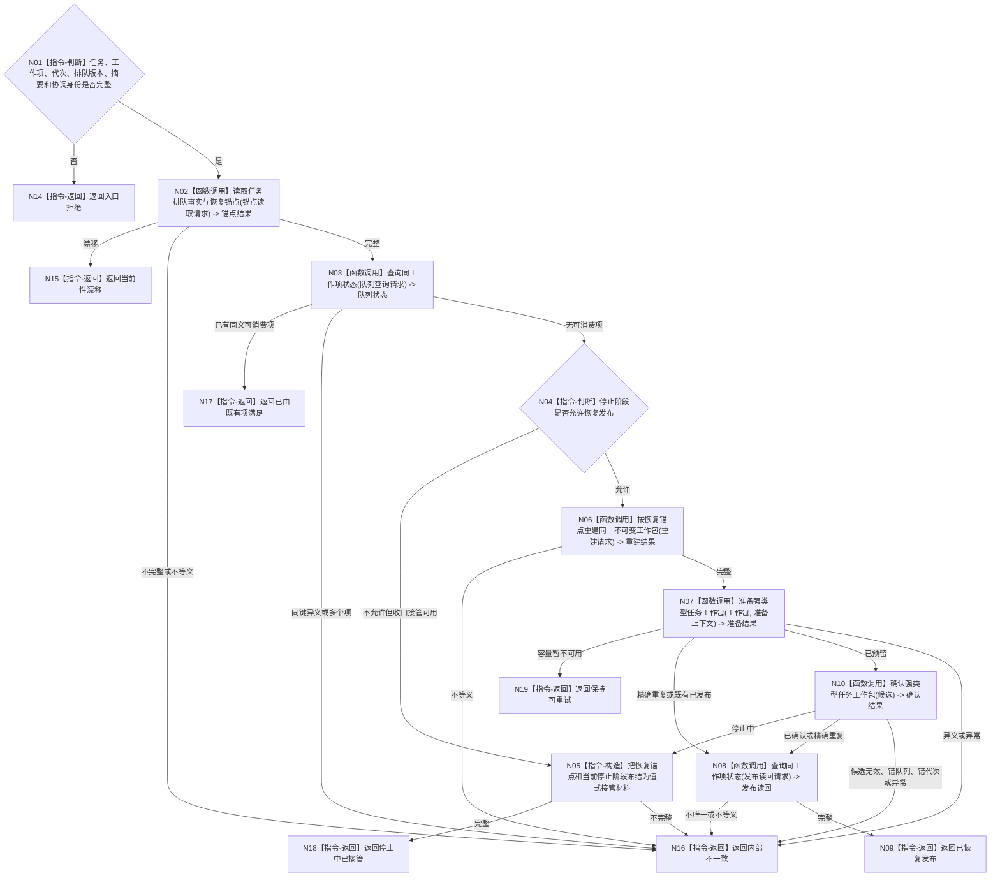

# BIZ-L3-004-04-06 协调已排队任务与未发布工作项目标函数流程图 v0.1

更新时间：2026-08-03

## 依据

```text
3200、4050、5090、5210、5230、8100；BIZ-L2-004-04
```

## 身份与边界

正式目标函数设计图。修复任务排队事实已发布但队列工作项未公开的派发窗口：只按任务恢复锚点重建并发布同一工作项，或保持可重试；不倒退任务、不生成第二项。

## 函数合同

```text
根函数：任务工作调度路由::协调已排队任务与未发布工作项
归属模块 / 文件 / 层级：任务工作调度 / 海中鱼巣/线程/路由.任务工作调度.ixx / L3
现有或待新增：待新增；当前执行调度确认失败直接返回内部不一致，缺恢复协调
完整签名：任务工作派发协调结果 任务工作调度路由::协调已排队任务与未发布工作项(const 任务工作派发协调请求& 请求) const
参数：请求为只读借用；含任务、工作项身份、运行代次、排队发布版本、冻结摘要、原候选结果、停止阶段版本和协调幂等身份
返回结果：不可变值式结果；含已恢复发布、已由既有项满足、保持可重试、停止中已接管、当前性漂移或内部不一致，以及唯一发布身份或恢复接管材料
被调函数流程图：BIZ-L4-004-04-06-01 读取任务排队事实与恢复锚点；BIZ-L4-004-04-06-02 查询同工作项状态；BIZ-L4-004-04-06-03 按恢复锚点重建同一不可变工作包；队列发布复用BIZ-L3-004-04-02和BIZ-L3-004-04-05
父图：BIZ-L2-004-04
```

## 流程图



## 节点合同

| 节点 | 类型 | 输入 | 输出 | 事实读写 | 验证 |
| --- | --- | --- | --- | --- | --- |
| N02/N03 | 函数调用 | 任务和工作项 | 权威锚点与队列状态 | 只读任务事实/队列 | 见BIZ-L4-004-04-06-01—02；同工作项等义互证 |
| N04—N06 | 判断 / 指令 / 调用 | 锚点和停止阶段 | 接管材料或同一工作包 | 不改任务事实 | 见BIZ-L4-004-04-06-03；不倒退任务、不改工作身份 |
| N07/N10 | 函数调用 | 同一工作包 | 队列候选与确认结果 | 仅队列内部状态 | 复用BIZ-L3-004-04-02/05 |
| N08/N09 | 调用 / 返回 | 发布身份 | 唯一可消费读回 | 只读队列 | 单项、同义、同代次 |

## 关键边界

协调不是业务补偿事务：排队事实保持不变，只恢复其所指向的同一个值式工作包。容量不足是可重试，不得将任务写成失败、取消或待重筹办；停止阶段必须显式接管，不能静默丢弃。
