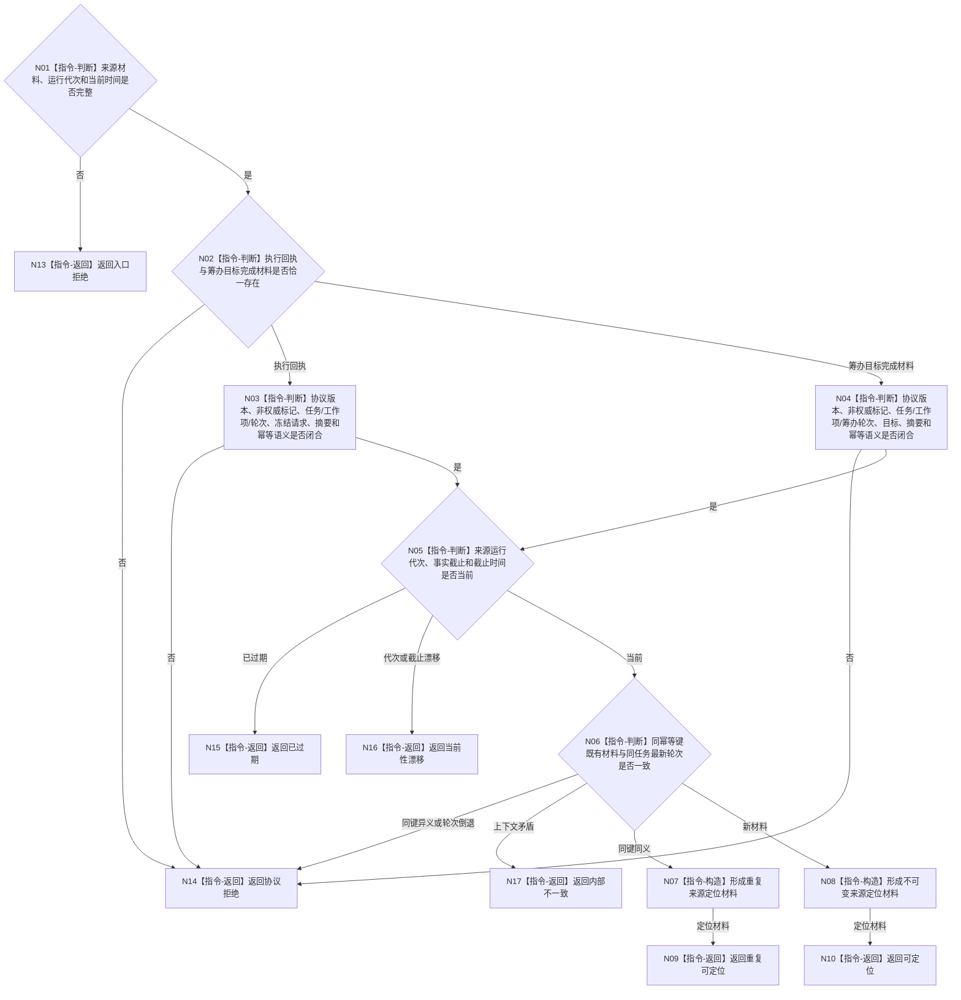

# BIZ-L3-004-05-01 复核任务结果来源协议目标函数流程图 v0.1

更新时间：2026-08-03

## 依据

```text
0050、5090、8100、8210；BIZ-L2-004-05、BIZ-L2-004-08
```

## 身份与边界

正式目标函数设计图。只复核执行回执或筹办“目标已完成”材料能否作为独立回读的非权威定位来源；不读取领域事实，不裁决任务完成、需求满足或目标是否已达成。

## 函数合同

```text
根函数：复核任务结果来源协议
归属模块 / 文件 / 层级：任务结果来源协议 / 海中鱼巣/线程/任务结果来源协议.ixx / L3
现有或待新增：适配扩展；复用现行任务结果回执协议，新增筹办目标完成材料、统一来源种类和运行代次合同
完整签名：任务结果来源协议复核结果 复核任务结果来源协议(const 任务结果来源协议复核请求& 请求)
参数：请求为只读借用；含执行结果回执或筹办目标完成材料恰一项、当前运行代次、当前时间戳、可选同幂等键既有材料和同任务最新轮次
返回结果：调用方拥有的不可变值式结果；含可定位、重复可定位、入口拒绝、协议拒绝、已过期、当前性漂移或内部不一致，以及来源种类、任务、工作项、任务轮次、事实截止版本、目标和可选执行证据定位材料
被调函数流程图：各强类型来源材料的字段级复核为本函数内协议判断；不进入领域读取
父图：BIZ-L2-004-05；BIZ-L2-004-08可复用
```

## 流程图



## 节点合同

| 节点 | 类型 | 输入 | 输出 | 事实读写 | 验证 |
| --- | --- | --- | --- | --- | --- |
| N02—N04 | 指令-判断 | 强类型来源联合体 | 来源种类与字段闭合结论 | 无 | 两类来源互斥；筹办分支不得补造方法或动态 |
| N05/N06 | 指令-判断 | 代次、时间、幂等和轮次 | 当前性与防重结论 | 无 | 旧代次、过期、同键异义、轮次倒退分离 |
| N07/N08 | 指令-构造 | 已通过协议材料 | 不可变定位材料 | 无 | 只保留定位与防重字段，不升级为事实 |
| N09/N10/N13—N17 | 指令-返回 | 复核状态 | 结构化协议结果 | 无 | 普通拒绝与内部不一致分离 |

## 关键边界

来源材料只能定位待回读对象。`可定位`、`重复可定位`、方法返回成功、工作线程退出和筹办自报目标完成都不证明目标实际满足；后继必须从正式领域服务重新读取同截止事实。

