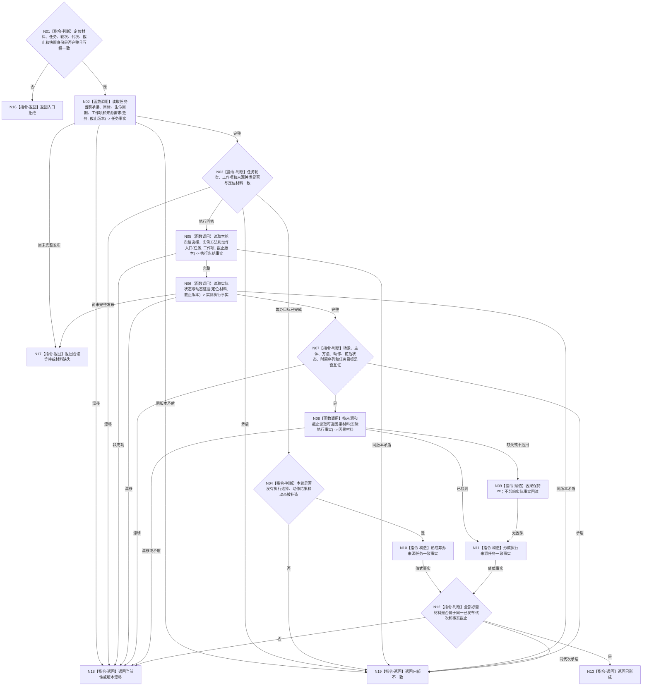

# BIZ-L3-004-05-02 读取任务结果一致事实目标函数流程图 v0.1

更新时间：2026-08-03

## 依据

```text
0050、5090、5300、8100、8210；BIZ-L2-004-05
```

## 身份与边界

正式目标函数设计图。使用已通过来源协议的定位材料，在固定运行代次和事实截止版本下回读任务、任务目标及与来源种类对应的实际执行事实；不比较目标，不提交任务结果。

## 函数合同

```text
根函数：运行期只读查询组合器::读取任务结果一致事实
归属模块 / 文件 / 层级：运行期只读查询 / 海中鱼巣/领域/组合.运行期只读查询.ixx / L3
现有或待新增：适配扩展；复用现行复核任务结果的任务、方法、状态和动态读取，改为返回完整值式事实并支持筹办目标完成来源
完整签名：任务结果一致事实结果 运行期只读查询组合器::读取任务结果一致事实(const 任务结果一致事实请求& 请求) const
参数：请求为只读借用；含已复核来源定位材料、任务稳定身份、任务轮次、运行代次、事实截止版本和世界快照身份
返回结果：调用方拥有的不可变值式结果；含已形成、合法等待、材料缺失、当前性漂移、版本漂移、许可拒绝或内部不一致，以及任务、来源需求、任务目标、生命周期、工作项和按来源种类可选的选择、实例方法、动作入口、实际状态、动态、因果及全部来源版本
被调函数流程图：BIZ-L4-004-05-02-01 读取任务承接目标生命周期与来源需求；BIZ-L4-004-05-02-02 读取本轮选择实例与动作入口；BIZ-L4-004-05-02-03 读取实际状态与动态证据；BIZ-L4-004-05-02-04 按来源和截止读取可选因果材料
父图：BIZ-L2-004-05
```

## 流程图



## 节点合同

| 节点 | 类型 | 输入 | 输出 | 事实读写 | 验证 |
| --- | --- | --- | --- | --- | --- |
| N02 | 函数调用 | 任务和固定截止 | 任务、目标、需求、轮次和工作项 | 只读任务/需求服务 | 唯一承接、同轮、同工作项 |
| N04 | 指令-判断 | 筹办来源任务事实 | 无执行材料结论 | 无 | 不因筹办自报完成补造方法、动作或动态 |
| N05/N06 | 函数调用 | 执行来源定位与任务事实 | 冻结选择、实例方法、状态和动态 | 只读方法/状态/动态服务 | 执行冻结与实际材料分账 |
| N07/N08 | 判断 / 调用 | 实际执行事实 | 互证结果和可选因果 | 只读因果服务 | 因果可缺省，实际状态不可缺省 |
| N10—N13 | 构造 / 判断 / 返回 | 分支事实 | 同截止不可变事实包 | 无写入 | 两类来源共用任务目标，执行字段保持可选 |

## 关键边界

本函数不以回执自报字段替代正式读取，也不以“动态存在”单独证明目标满足。筹办目标完成来源允许没有方法实例、动作和动态；执行来源则必须具备完整冻结和实际状态，动态及其来源必须按正式合同互证。
