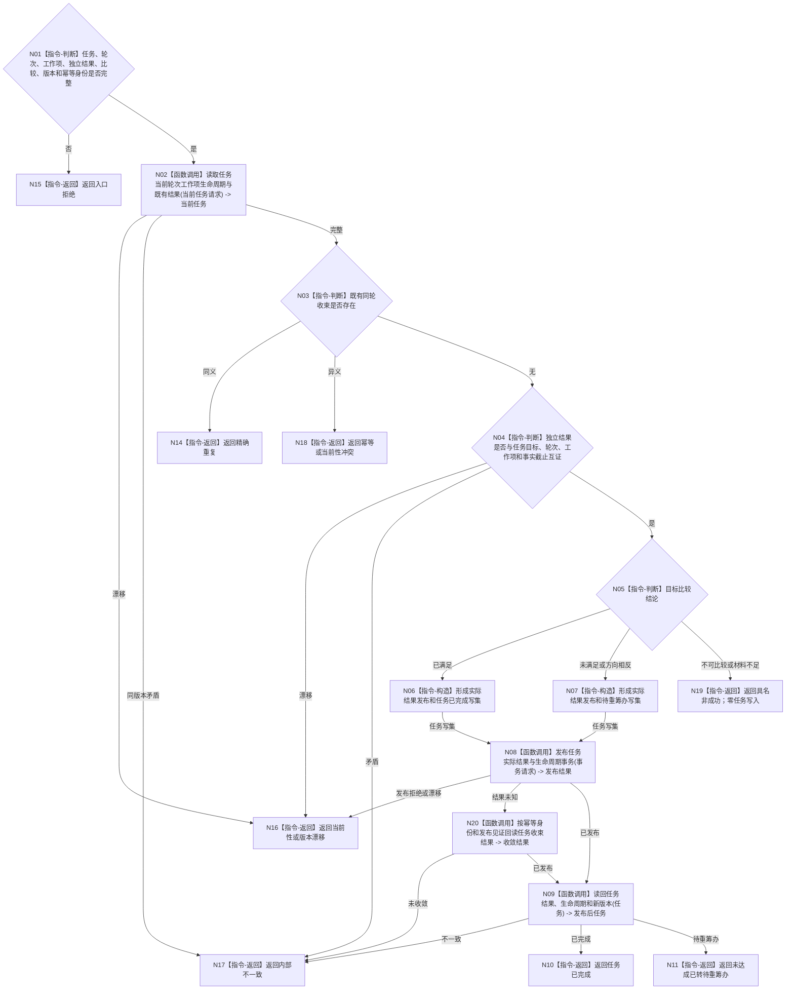

# BIZ-L3-004-06-01 收束任务实际结果目标函数流程图 v0.1

更新时间：2026-08-03

## 依据

```text
0050、3200、5090、5160、8100、8210；BIZ-L2-004-06
```

## 身份与边界

正式目标函数设计图。只在任务领域发布本轮实际结果，并按目标比较把任务迁移为已完成或待重筹办；不写需求结算、服务合同或服务值。

## 函数合同

```text
根函数：任务业务服务::收束任务实际结果
归属模块 / 文件 / 层级：任务领域 / 海中鱼巣/领域/服务.任务.ixx / L3
现有或待新增：适配扩展；复用现行提交实际结果并完成，增加目标未满足时同轮结果发布和待重筹办收束
完整签名：任务实际结果收束结果 任务业务服务::收束任务实际结果(const 任务实际结果收束请求& 请求)
参数：请求为只读借用；含独立实际结果、任务稳定身份、任务轮次、工作项、预期任务版本、任务收束幂等身份、目标比较和事实截止版本
返回结果：调用方拥有的不可变值式结果；含任务已完成、未达成已转待重筹办、精确重复、入口拒绝、当前性漂移、版本漂移或内部不一致，以及已发布任务结果、生命周期和新版本
被调函数流程图：BIZ-L4-004-06-01-01 读取任务当前轮次工作项生命周期与既有结果；BIZ-L4-004-06-01-02 发布任务实际结果与生命周期事务
父图：BIZ-L2-004-08
```

## 流程图



## 节点合同

| 节点 | 类型 | 输入 | 输出 | 事实读写 | 验证 |
| --- | --- | --- | --- | --- | --- |
| N02—N05 | 读取 / 判断 | 当前任务与独立结果 | 收束分支 | 只读任务事实 | 同轮、同工作项、同截止、幂等 |
| N06/N07 | 指令-构造 | 实际结果和比较 | 单任务领域写集 | 候选不可见 | 完成与待重筹办分离 |
| N08/N20 | 函数调用 | 写集和发布身份 | 发布结果 | 原子发布任务新代次 | 结果未知只按原身份收敛 |
| N09—N11 | 读回 / 返回 | 已发布任务 | 结构化收束结果 | 只读发布后任务 | 读回完整、版本推进 |

## 关键边界

方法返回、回执或动态存在不能直接触发任务完成。目标未满足时仍保留真实结果，但任务进入待重筹办而非失败；需求结算必须等本函数的已发布任务结果后独立执行。
