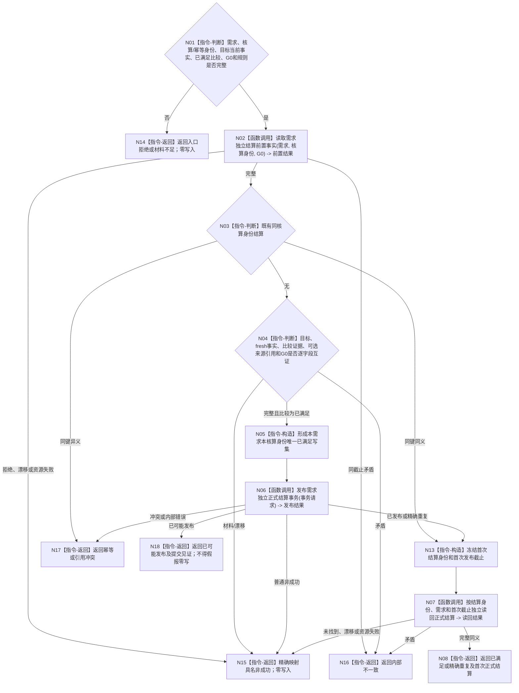

# BIZ-L3-004-06-02 提交并读回需求独立正式结算目标函数流程图 v0.2

更新时间：2026-08-26

## 依据

```text
0050、3100、5090 v0.8、5160 v0.5、8210；BIZ-L2-004-06 v0.3；BIZ-L3-004-01-01 v0.3、004-01-02 v0.2
```

## 身份与边界

正式目标函数设计图。需求领域只消费本需求同一 `G0` 的完整目标、fresh 当前事实和正式比较结果，发布或精确重放本次核算唯一 `已满足` 结论，并按返回身份独立读回。来源任务结果和轮次发起调用均为可选引用；它们不能替代 fresh 当前事实。任务轮次收束、调用槽结算、价值、预算、风险和归因保持独立。

## 函数合同

```text
根函数：需求业务服务::提交并读回需求独立正式结算
归属模块 / 文件 / 目标分解深度：需求领域 / 海中鱼巣/领域/服务.需求结算.ixx / BIZ-L3
现有或待新增：待新增；发布源码尚无 `L2需求结算结构`，当前工作区旧WIP不作为实现证据
完整签名：需求独立正式结算结果 需求业务服务::提交并读回需求独立正式结算(const 需求独立正式结算请求& 请求) noexcept
参数：请求为只读借用；含需求、本次核算身份、结算幂等身份、完整成功的目标当前事实结果、完整 `已满足` 比较结果、G0、结算规则版本，以及零或一来源任务实际结果引用、零或一轮次发起调用引用
返回结果：值式结果；含已满足、精确重复、入口/许可拒绝、当前性/版本漂移、引用/幂等冲突、材料不足、资源失败、已可能发布或内部不一致；成功携带首次正式结算和独立读回截止
被调函数流程图：BIZ-L4-004-06-02-01 读取需求结算前置事实；BIZ-L4-004-06-02-02 发布需求正式结算事务
父图：BIZ-L2-004-06
```

## 流程图



## 节点合同

| 节点 | 类型 | 输入 | 输出 | 事实读写 | 验证 |
| --- | --- | --- | --- | --- | --- |
| N02—N04 | 读取 / 判断 | 需求、核算身份、目标/fresh/比较和可选来源引用 | 唯一结算资格 | 只读需求结算前置 | 来源任务和调用均可空；有值才逐字段互证 |
| N05/N06 | 构造 / 调用 | 完整已满足证据 | 唯一需求结算写集 | 需求 owner 原子发布 | 同键同义、异义冲突、已可能发布 |
| N13/N07 | 构造 / 调用 | 首次结算身份和截止 | 独立正式读回 | 只读结算 owner | 重放必须读回首次记录，不以当前线程值补写 |
| N08/N14—N18 | 返回 | 完整读回或具名非成功 | 结构化结算结果 | 无额外写入 | 所有非成功不建立第二结算 |

## 关键边界

- 正式满足结论不再要求来源任务结果或“恰一动态”；必要状态 / 动态证据由本次目标合同和 fresh 当前事实合同决定。
- 比较为未满足、方向相反、不可比较或材料不足时父图直接返回，不能调用本函数把非成功写成正式满足。
- 历史已满足记录不永久证明当前仍满足；每个新核算身份仍须 fresh 读取和比较。
- 发布源码尚无 `L2需求本轮核算事实` 及其正式服务；当前工作区旧WIP即使仍绑定来源任务、任务轮次、正式结果和消费分配记录，也不构成本图 v0.2 的实现证据。
