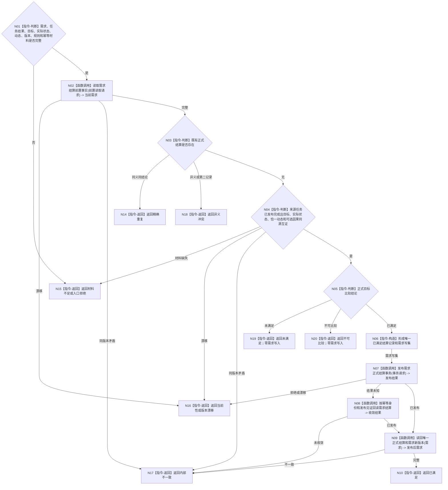

# BIZ-L3-004-06-02 提交需求正式结算目标函数流程图 v0.1

更新时间：2026-08-03

## 依据

```text
0050、3100、5090、5160、8210；BIZ-L2-004-06
```

## 身份与边界

正式目标函数设计图。需求领域以已发布任务结果和独立实际事实为证据，只发布唯一正式“已满足”结论；任务完成、风险事实和价值结算保持独立。

## 函数合同

```text
根函数：需求业务服务::提交需求正式结算
归属模块 / 文件 / 层级：需求领域 / 海中鱼巣/领域/服务.需求.ixx / L3
现有或待新增：适配扩展；复用现行提交独立结算并改为消费完整独立结果与目标比较材料
完整签名：需求正式结算提交结果 需求业务服务::提交需求正式结算(const 需求正式结算提交请求& 请求)
参数：请求为只读借用；含需求、来源任务及结果轮次、目标合同、实际状态、恰一动态证据、可选因果、目标比较、预期需求版本、结算幂等身份、事实截止和规则版本
返回结果：调用方拥有的不可变值式结果；含已满足、精确重复、未满足、材料不足、不可比较、入口拒绝、当前性漂移、版本漂移、异义冲突或内部不一致，以及正式结算记录和需求新版本
被调函数流程图：BIZ-L4-004-06-02-01 读取需求结算前置事实；BIZ-L4-004-06-02-02 发布需求正式结算事务
父图：BIZ-L2-004-06
```

## 流程图



## 节点合同

| 节点 | 类型 | 输入 | 输出 | 事实读写 | 验证 |
| --- | --- | --- | --- | --- | --- |
| N02—N05 | 读取 / 判断 | 需求、任务和独立结果 | 结算资格 | 只读需求/任务/状态/动态/因果 | 唯一承接、恰一动态、同源、正式比较 |
| N06 | 指令-构造 | 已满足证据 | 唯一需求结算写集 | 候选不可见 | 只允许“已满足”正式结论 |
| N07/N08 | 函数调用 | 写集和发布身份 | 发布或收敛结果 | 原子发布需求新代次 | 同键同义、异义冲突 |
| N09/N10 | 读回 / 返回 | 已发布需求 | 正式结算结果 | 只读发布后需求 | 第二记录属于内部不一致 |

## 关键边界

筹办阶段发现目标已完成但缺少 5160 要求的恰一动态证据时，可以收束任务，却不能补造需求正式结算。风险、副作用和服务价值资格另行裁决，不被“已满足”覆盖。
