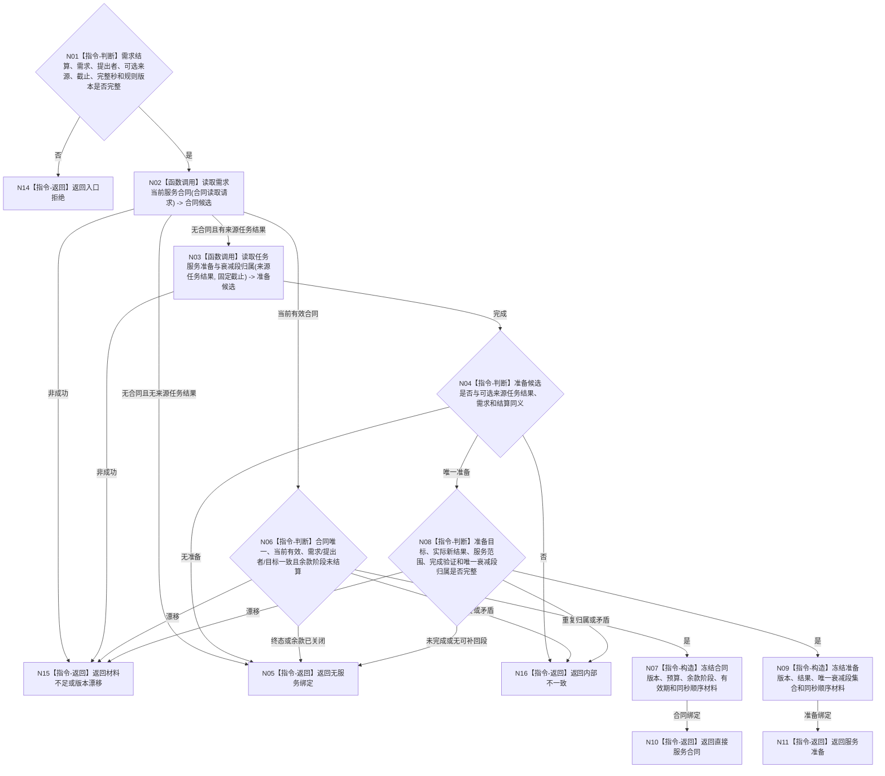

# BIZ-L3-004-06-03 读取当前服务合同或服务准备目标函数流程图 v0.2

更新时间：2026-08-26

## 依据

```text
0050、5160 v0.5、6100、6160、6170；BIZ-L2-004-06 v0.3、BIZ-L3-004-06-02 v0.2
```

## 身份与边界

正式目标函数设计图。按已发布需求独立结算先读取需求当前直接服务合同；只有没有直接合同且结算携带合法来源任务结果时，才读取该任务对应的服务准备归属。两类来源互斥形成同截止值式绑定材料；不要求每次需求结算都带任务，不迁移合同终态，不分配衰减段，不计算或写入服务值。

## 函数合同

```text
根函数：服务合同业务服务::读取当前服务合同或服务准备
归属模块 / 文件 / 目标分解深度：服务合同领域 / 海中鱼巣/领域/服务.服务合同.ixx / BIZ-L3
现有或待新增：待新增；当前尚无统一服务合同与准备读取入口
完整签名：服务绑定读取结果 服务合同业务服务::读取当前服务合同或服务准备(const 服务绑定读取请求& 请求) const
参数：请求为只读借用；含已发布需求独立结算、需求、提出者、零或一来源任务结果引用、事实截止版本、完整秒边界、运行代次和规则版本
返回结果：调用方拥有的不可变值式结果；含无服务绑定、直接服务合同、服务准备、材料不足、当前性漂移、版本漂移、许可拒绝或内部不一致，以及合同或准备、当前状态、预算阶段、有效期、准备结果和唯一归属衰减段集合
被调函数流程图：BIZ-L4-004-06-03-01 读取需求当前服务合同；BIZ-L4-004-06-03-02 读取任务服务准备与衰减段归属
父图：BIZ-L2-004-06
```

## 流程图



## 节点合同

| 节点 | 类型 | 输入 | 输出 | 事实读写 | 验证 |
| --- | --- | --- | --- | --- | --- |
| N02/N03 | 函数调用 | 已结算需求、可选来源和固定截止 | 合同或准备候选 | 只读服务合同/准备事实 | 先合同；无合同且有来源才读准备 |
| N04/N06/N08 | 指令-判断 | 唯一候选 | 唯一绑定资格 | 无 | 合同与准备不并行猜测，合同唯一、衰减段唯一归属 |
| N07/N09 | 指令-构造 | 完整绑定 | 同截止值式材料 | 无写入 | 完整秒、状态、预算和版本冻结 |
| N05/N10/N11/N14—N16 | 指令-返回 | 读取状态 | 结构化绑定结果 | 无写入 | 无绑定不是失败，矛盾停止依赖路径 |

## 关键边界

需求已满足只允许本函数读取绑定，不等于合同已经完成、余款已经支付或准备补回已经成立。没有来源任务结果时不补造服务准备；有来源也不跳过直接合同读取。合同终态和服务值变化必须由后继服务生存治理聚合事务一次发布。
