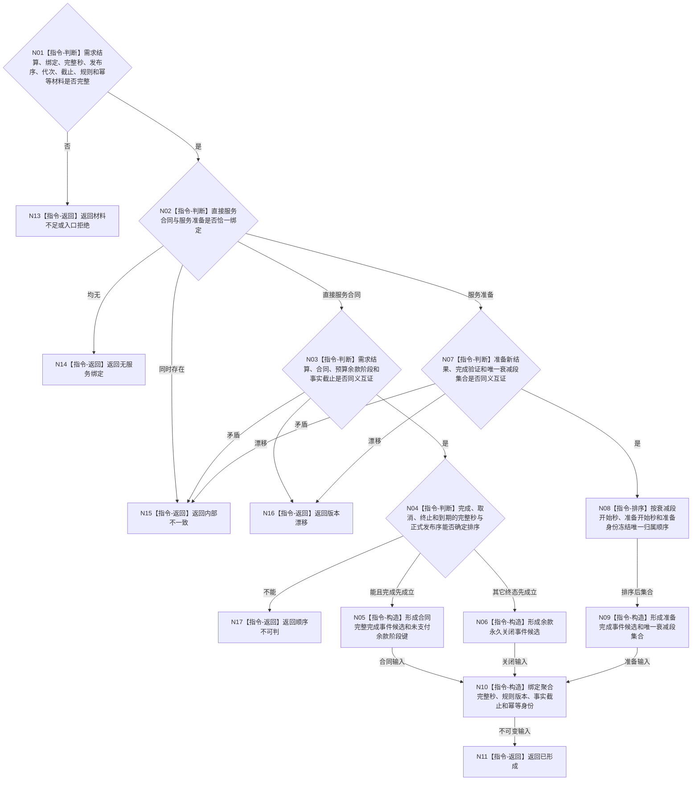

# BIZ-L3-004-06-04 形成服务生存聚合输入目标函数流程图 v0.1

更新时间：2026-08-03

## 依据

```text
0050、6100、6160、6170；BIZ-L2-004-06、BIZ-L2-003-02
```

## 身份与边界

正式目标函数设计图。把已发布需求结算和唯一服务绑定规范化为下一治理批次可消费的不可变输入；不产生合同终态事实，不计算最终结算量，不写服务值或生存安全根。

## 函数合同

```text
根函数：服务生存结算输入形成器::形成服务生存聚合输入
归属模块 / 文件 / 层级：服务生存结算输入算法 / 海中鱼巣/领域/算法.服务生存结算输入.ixx / L3
现有或待新增：待新增；为任务需求结算与服务生存治理之间建立强类型值式边界
完整签名：服务生存聚合输入形成结果 服务生存结算输入形成器::形成服务生存聚合输入(const 服务生存聚合输入形成请求& 请求) const
参数：请求为只读借用；含已发布需求正式结算、直接服务合同或服务准备恰一绑定、事实发生完整秒、聚合完整秒边界、事实发布序、运行代次、事实截止、规则版本和聚合幂等身份
返回结果：调用方拥有的不可变值式结果；含已形成、无服务绑定、材料不足、顺序不可判、版本漂移或内部不一致，以及合同完整完成事件候选与余款阶段键，或准备完成事件候选与唯一衰减段集合
被调函数流程图：无；字段验证、确定排序和构造均为本函数内指令
父图：BIZ-L2-004-06；BIZ-L2-003-02消费
```

## 流程图



## 节点合同

| 节点 | 类型 | 输入 | 输出 | 事实读写 | 验证 |
| --- | --- | --- | --- | --- | --- |
| N02/N03/N07 | 指令-判断 | 已发布结算和唯一绑定 | 输入资格 | 无 | 两类互斥、同义互证、版本完整 |
| N04 | 指令-判断 | 同秒事实与发布序 | 唯一终态顺序 | 无 | 不用容器、消息或日志顺序猜测 |
| N05/N06/N09 | 指令-构造 | 合同或准备材料 | 事件候选 | 无 | 候选不取得事实权和结算权 |
| N08 | 指令-排序 | 已发布衰减段归属 | 确定集合 | 无 | 同段最多归属一个准备 |
| N10/N11 | 构造 / 返回 | 事件候选与版本 | 聚合输入 | 无写入 | 后继一次消费、防重复 |

## 关键边界

本函数只形成值式输入。70% 余款、准备补回、同秒衰减和生存安全回归的金额及最终发布，均由 `维护服务与生存安全` 所属聚合事务裁决；饱和舍弃和阶段完成也不能在此提前宣布。
