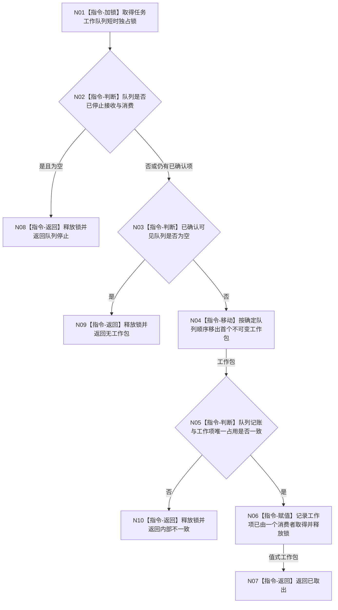

# BIZ-L3-004-07-01 取出一个不可变任务工作包目标函数流程图 v0.1

更新时间：2026-08-03

## 依据

```text
0050、5090、5230、8100；BIZ-L2-004-07
```

## 身份与边界

正式目标函数设计图。由任务工作线程池的任一消费者竞争取出一份已确认可见的不可变工作包；只改变队列占用，不改变任务业务状态。

## 函数合同

```text
根函数：任务工作队列::取出一个不可变任务工作包
归属模块 / 文件 / 层级：任务工作队列 / 海中鱼巣/线程/任务工作队列.ixx / L3
现有或待新增：适配扩展；复用现行执行请求取出并扩展统一筹办/执行工作包
完整签名：任务工作包取出结果 任务工作队列::取出一个不可变任务工作包()
参数：无
返回结果：调用方拥有的值式结果；含已取出、无工作包、队列停止或内部不一致，以及移动取得的不可变任务工作包
被调函数流程图：无；队列锁内检查与移动均为本函数内指令
父图：BIZ-L2-004-07
```

## 流程图



## 节点合同

| 节点 | 类型 | 输入 | 输出 | 事实读写 | 验证 |
| --- | --- | --- | --- | --- | --- |
| N01—N04 | 锁 / 判断 / 移动 | 已确认队列 | 一个工作包或空 | 只改队列占用 | 多消费者恰一取得 |
| N05/N06 | 判断 / 赋值 | 工作项记账 | 已取得见证 | 非业务调度状态 | 不以线程编号作为任务占用事实 |
| N07—N10 | 返回 | 队列状态 | 结构化结果 | 无业务写入 | 空、停止、错误分离 |

## 关键边界

候选尚未确认时不可见。返回工作包不得携带队列引用、锁、迭代器或可变内部指针；函数返回后所有长时业务操作都在队列锁外进行。
