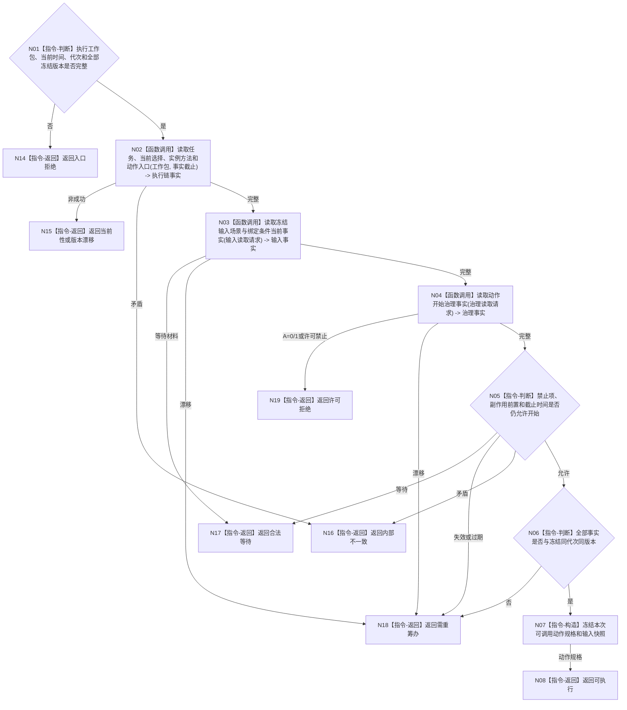

# BIZ-L3-004-07-02 复核任务方法与输入场景目标函数流程图 v0.1

更新时间：2026-08-03

## 依据

```text
0050、5090、5230、5300、6170、8100；BIZ-L2-004-07
```

## 身份与边界

正式目标函数设计图。在动作开始前按冻结版本重读任务、方法、输入场景、授权、许可、禁止项和生存控制态；只决定本工作项能否开始，不修改冻结或任务状态。

## 函数合同

```text
根函数：任务执行前复核服务::复核任务方法与输入场景
归属模块 / 文件 / 层级：任务执行前复核 / 海中鱼巣/领域/服务.任务执行前复核.ixx / L3
现有或待新增：适配扩展；复用现行执行请求冻结复核并补齐统一工作包与世界快照版本
完整签名：任务执行前复核结果 任务执行前复核服务::复核任务方法与输入场景(const 任务执行前复核请求& 请求) const
参数：请求为只读借用；含执行工作包、当前时间、运行代次、任务/选择/方法/动作/输入场景/授权/许可/权限和禁止项冻结版本
返回结果：不可变值式结果；含可执行、合法等待、需重筹办、许可拒绝、已过期、当前性漂移、版本漂移或内部不一致，以及可调用动作规格和同截止输入材料
被调函数流程图：执行链读取复用BIZ-L4-004-05-02-02；BIZ-L4-004-07-02-01 读取冻结输入场景与绑定条件当前事实；BIZ-L4-004-07-02-02 读取动作开始治理事实
父图：BIZ-L2-004-07
```

## 流程图



## 节点合同

| 节点 | 类型 | 输入 | 输出 | 事实读写 | 验证 |
| --- | --- | --- | --- | --- | --- |
| N02/N03 | 函数调用 | 冻结身份和截止 | 执行链与输入事实 | 只读任务/方法/世界服务 | 不按名称或缓存补齐 |
| N04/N05 | 调用 / 判断 | 工作项治理材料 | 许可与约束结论 | 只读授权/许可/权限 | A=0/1普通任务零权限 |
| N06/N07 | 判断 / 构造 | 全部当前事实 | 可调用动作规格 | 无写入 | 任一漂移进入新筹办轮次 |

## 关键边界

执行期发现冻结前已经缺方法、动作入口、条件结果对或必要规格，属于内部逻辑错误，不得临场补造。可执行只授权开始本次动作，不证明结果将发生。
