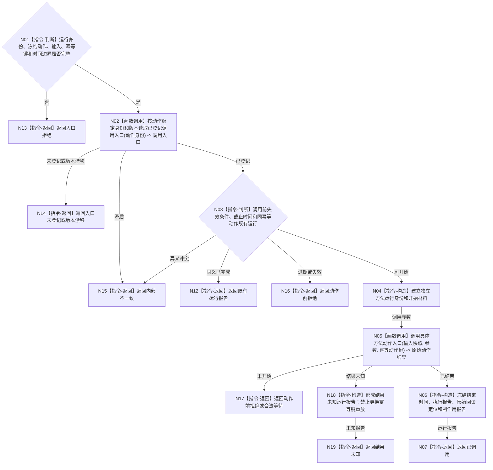

# BIZ-L3-004-07-03 调用冻结具体方法动作入口目标函数流程图 v0.1

更新时间：2026-08-03

## 依据

```text
0050、4220、5230、5300、8100、8210；BIZ-L2-004-07
```

## 身份与边界

正式目标函数设计图。按动作注册表调用冻结的唯一具体方法入口并形成运行报告；执行报告不是事实，也不裁决目标是否达成。

## 函数合同

```text
根函数：方法动作执行路由::调用冻结具体方法动作入口
归属模块 / 文件 / 层级：方法动作执行路由 / 海中鱼巣/领域/路由.方法动作执行.ixx / L3
现有或待新增：待新增通用强类型路由；具体动作入口由方法登记提供
完整签名：冻结方法动作调用结果 方法动作执行路由::调用冻结具体方法动作入口(const 冻结方法动作调用请求& 请求)
参数：请求为只读借用；含独立运行身份、任务/工作项/方法/动作入口、输入场景快照、参数、幂等动作键、开始截止时间和失效条件
返回结果：调用方拥有的不可变值式结果；含已调用、动作前拒绝、合法等待、结果未知、已过期、入口未登记或内部不一致，以及开始结束时间、执行报告、原始回读定位和副作用报告
被调函数流程图：被登记的具体动作入口各自作为独立业务函数按需进入L4
父图：BIZ-L2-004-07
```

## 流程图



## 节点合同

| 节点 | 类型 | 输入 | 输出 | 事实读写 | 验证 |
| --- | --- | --- | --- | --- | --- |
| N02/N03 | 读取 / 判断 | 冻结动作和幂等身份 | 可调用资格 | 只读方法登记 | 同键同义、异义拒绝 |
| N04/N05 | 构造 / 调用 | 输入快照与参数 | 原始动作结果 | 具体方法是动作来源候选 | 不持有队列或领域写锁 |
| N06/N18 | 指令-构造 | 原始结果 | 非权威运行报告 | 不写结果事实 | 成功、拒绝、未知分离 |

## 关键边界

发送指令成功、函数返回成功和执行报告成功都不能证明世界或治理事实已经变化。结果未知时只允许用原运行身份和幂等动作键查询收敛，不得重复真实外部动作。

