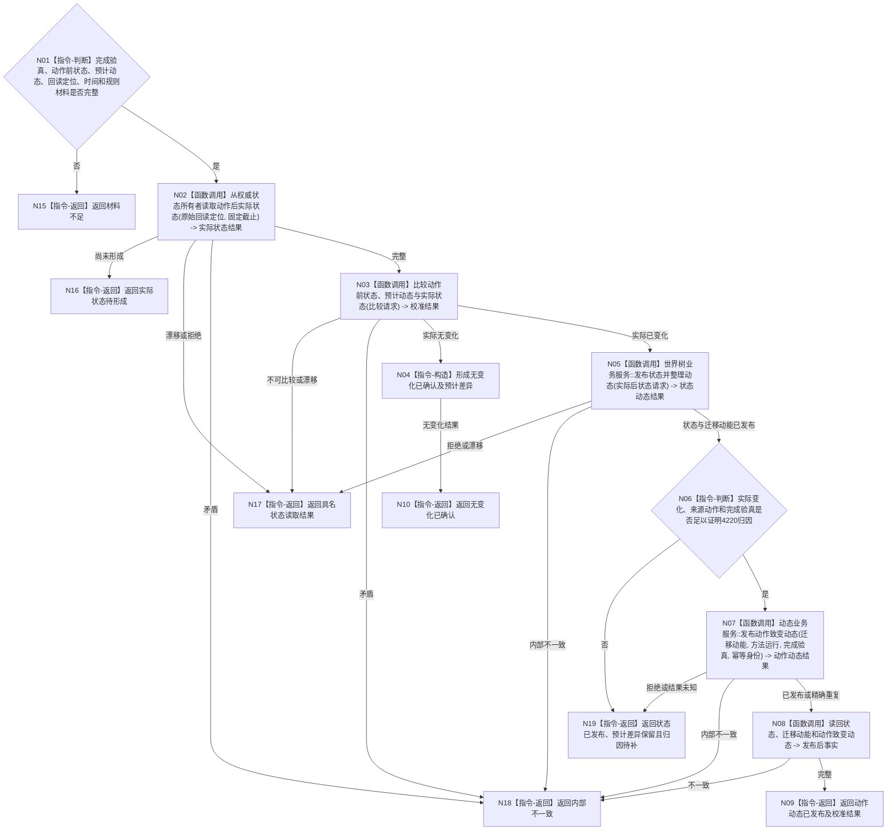

# BIZ-L3-004-07-04 校准并发布实际状态与动作动态目标函数流程图 v0.1

更新时间：2026-08-04

## 依据

```text
0050、4190、4200、4220、5090、5300、8210；BIZ-L2-004-07；确认稿第22、38项
```

## 身份与边界

正式目标函数设计图。根函数只在动作完成消息已经发布并经独立路径验真后，从权威状态所有者重新读取动作后实际状态，比较动作前状态、预计动态与实际状态，再发布能够证明的状态动态和动作致变动态。方法返回、预计动态和完成消息均不是正式事实。

## 函数合同

```text
根函数：动作结果事实组合器::校准并发布实际状态与动作动态
归属模块 / 文件 / 层级：动作结果事实组合 / 海中鱼巣/领域/组合.动作结果事实.ixx / L3
现有或待新增：待新增组合入口；复用权威状态读取、世界树状态发布和4220动作致变动态入口
完整签名：动作结果校准发布结果 动作结果事实组合器::校准并发布实际状态与动作动态(const 动作结果校准发布请求& 请求)
参数：请求为只读借用；含方法运行身份、动作完成验真、动作前权威状态、预计动作动态、原始回读定位、世界/场景/主体/特征、动作入口、发生时间、事实截止、幂等身份组和规则版本
返回结果：调用方拥有的不可变值式结果；含无变化已确认、状态与迁移动能已发布、动作动态已发布、实际状态待形成、预计不一致、归因待补、材料不足、版本漂移或内部不一致，以及实际状态、校准差异、迁移动能和可选动作致变动态
被调函数流程图：权威状态所有者的具名实际状态读取；世界树业务服务::发布状态并整理动态复用4200正式设计包；BIZ-L4-004-07-04-01 发布动作致变动态
父图：BIZ-L2-004-07
```

## 流程图



## 节点合同

| 节点 | 类型 | 输入 | 输出 | 事实读写 | 验证 |
| --- | --- | --- | --- | --- | --- |
| N02 | 函数调用 | 已验真动作身份和原始回读定位 | 动作后权威实际状态 | 只读正式状态所有者 | 不读取方法返回、完成消息摘要、日志或缓存补值 |
| N03/N04 | 函数调用 / 构造 | 前状态、预计动态和实际状态 | 校准差异或无变化结果 | 无写入 | 预计与实际分账；无变化不伪造动态 |
| N05 | 函数调用 | 已确认实际后状态 | 状态与可选迁移动能 | 世界树入口发布 | 状态迁移动能不带来源动作 |
| N06/N07 | 判断 / 调用 | 已发布迁移动能、方法运行和完成验真 | 动作致变动态 | 动态领域独立发布 | 关系20角色和同源端点 |
| N08—N10 | 读回 / 返回 | 已发布事实或无变化 | 结构化校准发布结果 | 只读 | 已发布前级不因后级失败撤销 |

## 关键边界

状态发布成功而动作动态尚未发布时，状态仍是真实世界事实；只能返回“归因待补”并停止任务完成依赖路径。不得撤销状态、重复外部动作或用完成消息、工作线程回执补造归因。

