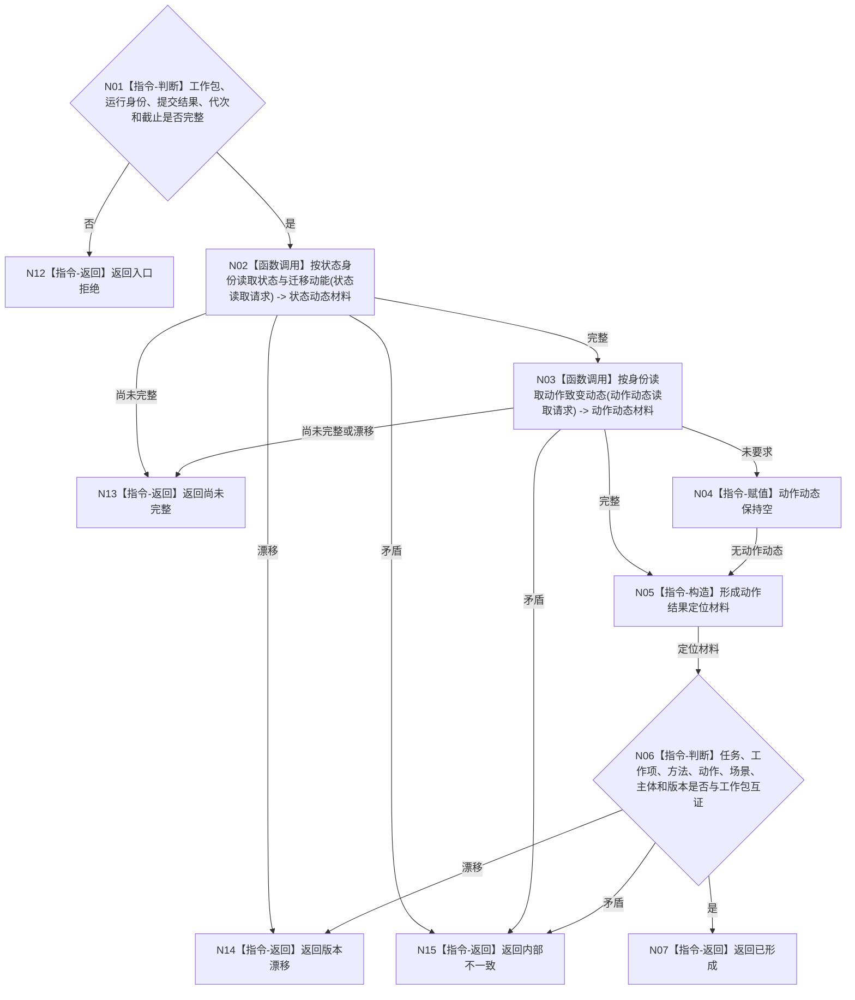

# BIZ-L3-004-07-05 读取已发布动作结果定位材料目标函数流程图 v0.1

更新时间：2026-08-03

## 依据

```text
0050、4190、4220、5090、8210；BIZ-L2-004-07 v0.2、BIZ-L2-004-08 v0.3
```

## 身份与边界

正式目标函数设计图。工作线程只从已发布事实提取供回执定位的稳定身份和版本，不判断任务目标、不形成任务实际结果权威。

## 函数合同

```text
根函数：运行期只读查询组合器::读取已发布动作结果定位材料
归属模块 / 文件 / 目标分解深度：运行期只读查询 / 海中鱼巣/领域/组合.运行期只读查询.ixx / BIZ-L3
现有或待新增：待新增轻量定位读取；不得与独立回读任务实际结果合并
完整签名：动作结果定位读取结果 运行期只读查询组合器::读取已发布动作结果定位材料(const 动作结果定位读取请求& 请求) const
参数：请求为只读借用；含任务工作包、方法运行身份、动作结果校准发布结果、运行代次和事实截止版本
返回结果：调用方拥有的不可变值式结果；含已形成、尚未完整、版本漂移或内部不一致，以及任务、工作项、方法、动作、场景、主体、实际状态、迁移动能、可选动作动态和全部来源版本
被调函数流程图：BIZ-L4-004-07-05-01 按状态身份读取状态与迁移动能；BIZ-L4-004-07-05-02 按身份读取动作致变动态
父图：BIZ-L2-004-07 v0.2；材料只进入任务工作结果定位，随后由BIZ-L3-004-08-02从完成消息和动作后权威快照正式独立读回
```

## 流程图



## 节点合同

| 节点 | 类型 | 输入 | 输出 | 事实读写 | 验证 |
| --- | --- | --- | --- | --- | --- |
| N02/N03 | 函数调用 | 稳定身份和固定截止 | 状态、迁移和动作动态 | 只读领域服务 | 不从方法返回或日志取值 |
| N04/N05 | 赋值 / 构造 | 已发布事实 | 轻量定位材料 | 无 | 可选动作动态不补造 |
| N06/N07 | 判断 / 返回 | 定位材料与工作包 | 已形成结果 | 无 | 仅互证定位，不比较目标 |

## 关键边界

本函数只服务于强类型工作结果定位构造。任务管理线程必须经BIZ-L3-004-08-02从完成消息、动作后权威快照和task owner正式结果入口独立读回；不得把本函数结果、方法返回或旧回执直接提交为任务完成。旧BIZ-L2-004-05已退出当前目标树。
